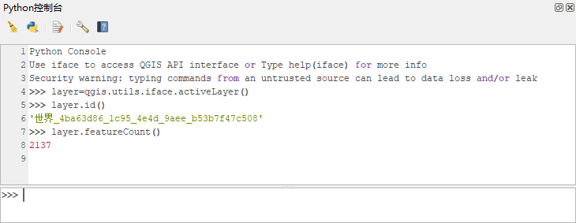
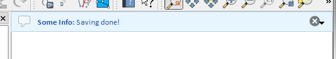
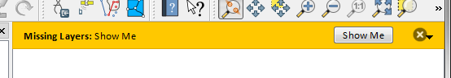
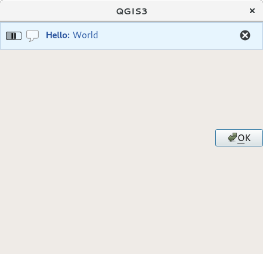

# PyQGIS开发者手册(3.4)

# 目录

[TOC]

# 1 引言

本文档既可作为教程，也可作为参考指南。虽然没有列举所有可能的案例，但是对主要功能有一个很好的概述。

对于Python的支持最初是在QGIS 0.9中引入的。 目前，在QGIS桌面版中有几种方法可以使用Python，如下：

- 在QGIS的Python控制台中
- 创建并使用插件
- QGIS启动时自动运行Python代码
- 基于QGIS API创建自定义应用程序

Python绑定也可用于QGIS服务，包括Python插件（请参阅[QGIS Server Python插件](#18 QGIS Server Python插件)）和Python绑定，可用于将QGIS服务嵌入到Python应用程序中。
这里有一个[完整的QGIS API](<https://qgis.org/api/>)参考——用于记录QGIS库中的类。 [Pythonic QGIS API（pyqgis）](https://qgis.org/pyqgis)几乎与C ++ API相同。
学习如何执行常见任务的一个好办法——是从[插件仓库](https://plugins.qgis.org/)下载现有插件并学习它们的代码。

## 1.1 在Python控制台中编写脚本

QGIS为脚本编写提供了一个集成的python控制台。可以从插件→python控制台菜单中打开：



上面的截图说明了如何获取图层列表中当前选定的图层，并显示其ID，如果是矢量图层，还可以选择显示要素个数。对于与qgis环境的交互，有一个iface变量，它是[QgisInterface](https://qgis.org/pyqgis/3.4/gui/QgisInterface.html#qgis.gui.QgisInterface)的一个实例。此接口允许访问地图画布、菜单、工具栏和QGIS应用程序的其他部分。

为了方便用户，在启动控制台时将会执行以下语句（将来可以设置更多的初始命令）

```python
from qgis.core import *
import qgis.utils
```

对于经常使用控制台的用户，设置打开控制台的快捷方式可能很有用（在设置→键盘快捷键...）

## 1.2 Python插件

可以使用插件来扩展QGIS的功能。现在也可以使用Python编写插件。与C ++插件相比，主要优点是分发简单（不对每个平台进行编译）、更容易的开发。

自从引入对Python的支持以来，已经编写了许多涵盖各种功能的插件。插件安装程序允许用户轻松获取、升级和删除Python插件。有关插件和插件开发的更多信息，请参阅[Python插件](https://plugins.qgis.org/)页面。

在Python中创建插件很简单，请参阅[开发Python插件](#15 开发Python插件)以获取详细说明。

------

**小贴士：** Python插件也可用于QGIS服务器（[QGIS as OGC数据服务器](https://docs.qgis.org/3.4/zh-Hant/docs/user_manual/working_with_ogc/server/index.html#label-qgisserver)），有关详细信息，请参阅[QGIS Server Python插件](#18 QGIS Server Python插件)。

------

## 1.3 QGIS启动时运行Python代码

每次QGIS启动时，都有两种不同的方法来运行Python代码。

1. 创建startup.py脚本
2. 将`PYQGIS_STARTUP`环境变量设置为现有Python文件

### 1.3.1 startup.py文件

每次QGIS启动时，用户的Python主目录都会搜索名为`startup.py`的文件。 如果该文件存在，则由嵌入式Python解释器执行。

- Linux： `.local/share/QGIS/QGIS3/profiles/default/python`
- Windows： `AppData\Roaming\QGIS\QGIS3\profiles\default\python`
- macOS： `Library/Application Support/QGIS/QGIS3/profiles/default`

---

**小贴士：** 默认路径取决于操作系统。要查找适合你的路径，请打开Python控制台，并运行`QStandardPaths.standardLocations(QStandardPaths.AppDataLocation)` 查看默认目录列表。

---

### 1.3.2 PYQGIS_STARTUP环境变量

你可以在QGIS初始化完成之前将`PYQGIS_STARTUP`环境变量设置为现有Python文件的路径来运行Python代码。

此代码将在QGIS初始化完成之前运行。此方法对于清理sys.path非常有用——可能存在不需要的路径，或用于隔离/加载初始环境——无需虚拟环境，例如在Mac上使用homebrew或MacPorts。

## 1.4 Python应用程序

为自动化流程创建脚本通常很方便。使用PyQGIS，这是完全可能的——导入`qgis.core`模块，初始化它，你就可以进行处理了。

或者你可能想要创建一个使用GIS功能的交互式应用程序——执行测量、将地图导出为PDF或任何其他功能。`qgis.gui`模块带来了各种GUI组件，最值得注意的是可以合并到应用程序中的地图画布控件——支持缩放，平移和任何其他自定义地图工具。

必须配置PyQGIS自定义应用程序或独立脚本以定位QGIS资源，例如投影信息，用于读取矢量和栅格图层的提供者等。QGIS资源通过在应用程序或脚本的开头添加几行（代码）来初始化。为自定义应用程序和独立脚本初始化QGIS的代码类似。以下提供各自的实例。

---

**小贴士：** 千万不能使用`qgis.py`作为你的测试脚本的名称，否则Python将无法导入绑定。

---

### 1.4.1 在独立脚本中使用PyQGIS

要启动独立脚本，请在脚本开头初始化QGIS资源，类似于以下代码：

```python
from qgis.core import *
# 提供qgis安装位置的路径(windows默认：C:\Program Files\QGIS 3.4\apps\qgis-ltr)
QgsApplication.setPrefixPath("/path/to/qgis/installation", True)
# 创建对QgsApplication的引用，第二个参数设置为False将禁用GUI
qgs = QgsApplication([], False)
# 加载提供者
qgs.initQgis()
# 在这里编写代码，加载一些图层，使用处理算法等
# 脚本完成后，调用exitQgis（）从内存中删除提供者和图层注册
qgs.exitQgis()
```

我们首先导入`qgis.core`模块，然后配置前缀路径。前缀路径是安装QGIS的路径。它通过调用`setPrefixPath`方法在脚本中配置。第二个参数设置为`True`，它控制是否使用默认路径。

QGIS安装路径因平台而异，在系统中找到它的最简单方法是在QGIS中使用[Python控制台](#1.1 在Python控制台中编写脚本)运行 `QgsApplication.prefixPath()`并查看输出。

配置前缀路径后，我们在变量`qgs`中保存了一个对`QgsApplication`的引用。第二个参数设置为`False`，表示我们不打算使用GUI，因为我们正在编写一个独立的脚本。配置`QgsApplication`后 ，我们通过调用`qgs.initQgis()`方法加载QGIS数据提供者和图层注册。在QGIS初始化后，我们准备编写脚本的其余部分。最后，我们通过调用`qgs.exitQgis()`从内存中删除数据提供者和图层注册来结束。

### 1.4.2 在自定义应用程序中使用PyQGIS

[在独立脚本中使用PyQGIS](#1.4.1 在独立脚本中使用PyQGIS)和自定义PyQGIS应用程序之间的唯一的区别是在实例化`QgsApplication`时的第二个参数。传递`True`而不是`False`，表示我们计划使用GUI。

```python
from qgis.core import *
# 提供qgis安装位置的路径(windows默认：C:\Program Files\QGIS 3.4\apps\qgis-ltr)
QgsApplication.setPrefixPath("/path/to/qgis/installation", True)
# 创建对QgsApplication设置的引用第二个参数为True启用GUI，我们需要这样做，因为这是一个自定义应用程序
qgs = QgsApplication([], True)
# 加载提供者
qgs.initQgis()
# 在这里编写代码，加载一些图层，使用处理算法等
# 脚本完成后，调用exitQgis（）从内存中删除提供者和图层注册
qgs.exitQgis()
```

现在，你可以使用QGIS API——加载图层并执行一些处理或使用地图画布启动GUI。

### 1.4.3 运行自定义应用程序

如果它们不在一个众所周知的位置，你需要告诉系统在哪里搜索QGIS库和合适的Python模块——否则Python会抛出异常：

```python
>>> import qgis.core
ImportError: No module named qgis.core
```

可以通过设置`PYTHONPATH`环境变量来修复。在以下命令中，`<qgispath>`应替换为你的实际QGIS安装路径：

- 在Linux上：**export PYTHONPATH=/qgispath/share/qgis/python**
- 在Windows上：**set PYTHONPATH=c:\qgispath\python**
- 在macOS上：**export PYTHONPATH=/qgispath/Contents/Resources/python**

现在，PyQGIS模块的路径设置完成，但它们依赖于`qgis_core`和`qgis_gui`库（仅仅作为封装的Python模块）。这些库的路径通常是操作系统未知的，因此再次出现导入错误（错误消息可能因系统而异）：

```python
>>> import qgis.core
ImportError: libqgis_core.so.3.2.0: cannot open shared object file:No such file or directory
```

通过将QGIS库所在的目录添加到动态链接器的搜索路径来解决此问题：

- 在Linux上：**export LD_LIBRARY_PATH=/qgispath/lib**
- 在Windows上：**set PATH=C:\qgispath\BIN; C:\qgispath\APPS\qgisrelease\BIN;PATH％** ，其中`qgisrelease`应替换成你的发布类型（例如，`qgis-ltr`，`qgis`，`qgis-dev`）

这些命令可以放入一个引导脚本，负责启动。使用PyQGIS部署自定义应用程序时，通常有两种可能：

- 要求用户在安装应用程序之前在其平台上安装QGIS。应用程序安装程序应查找QGIS库的默认位置，并允许用户设置路径（如果未找到）。该方法具有更简单的优点，但是它需要用户执行更多步骤。
- 将QGIS与你的应用程序一起打包。发布应用程序可能更具挑战性，并且程序包将更大，但用户将免于下载和安装其他软件的负担。

这两种部署模型可以混合使用——在Windows和macOS上部署独立应用程序，但是对于Linux，将QGIS的安装留给用户和他的包管理器。

## 1.5 有关PyQt和SIP的技术说明

我们决定使用Python，是因为它是最受欢迎的脚本语言之一。QGIS 3中的PyQGIS绑定依赖于SIP和PyQt5。使用SIP而不是更广泛使用的SWIG的原因是QGIS代码依赖于Qt库。Qt（PyQt）的Python绑定也使用SIP完成，这允许PyQGIS与PyQt无缝集成。

# 2 加载项目

有时你需要从插件加载现有项目，或者在开发独立的QGIS Python应用程序时加载（请参阅：[Python应用程序](#1.4 python应用程序)）。

将项目加载到当前QGIS应用程序中，需要创建[`QgsProject`](https://qgis.org/pyqgis/3.4/core/QgsProject.html#qgis.core.QgsProject)类的实例。这是一个单例类，因此你必须使用其[`instance()`](https://qgis.org/pyqgis/3.4/core/QgsProject.html#qgis.core.QgsProject.instance)方法来执行此操作。你可以调用[`read()`](https://qgis.org/pyqgis/3.4/core/QgsProject.html#qgis.core.QgsProject.read)方法，传递加载的项目的路径：

```python
# 如果你不在QGIS控制台内运行，首先需要导入qgis和PyQt类，如下所示：
from qgis.core import QgsProject
# 获取项目实例
project = QgsProject.instance()
# 打印当前项目的文件名（可能为空，因为没有项目加载）
print(project.fileName())
'/home/user/projects/my_qgis_project.qgs'
# 加载另一个项目
project.read('/home/user/projects/my_other_qgis_project.qgs')
print(project.fileName())
# '/home/user/projects/my_other_qgis_project.qgs'
```

如果需要对项目进行修改（例如添加或删除某些图层）并保存更改，请调用[`write()`](https://qgis.org/pyqgis/3.4/core/QgsProject.html#qgis.core.QgsProject.write)方法。该方法还支持将项目保存到新的位置：

```python
# 将项目保存到同一个文件
project.write()
# ...或新文件
project.write('/home/user/projects/my_new_qgis_project.qgs')
```

read()和write()函数都返回一个布尔值，你可以使用它来检查操作是否成功。

---

**小贴士：** 如果你正在编写QGIS独立应用程序，为了将加载的项目与画布同步，你需要实例化[`QgsLayerTreeMapCanvasBridge`](https://qgis.org/pyqgis/3.4/gui/QgsLayerTreeMapCanvasBridge.html#qgis.gui.QgsLayerTreeMapCanvasBridge)，如下例所示：

---

```python
bridge = QgsLayerTreeMapCanvasBridge(QgsProject.instance().layerTreeRoot(), canvas)
# 现在你可以安全地加载项目，并在画布上看到它
project.read('/home/user/projects/my_other_qgis_project.qgs')
```

# 3 加载图层

此页面上的代码片段需要导入以下模块：

```python
import os # pyqgis控制台同样需要
from qgis.core import (
	QgsVectorLayer
)
```

让我们用数据打开一些图层。QGIS可识别矢量和栅格图层。此外，自定义图层类型也可以使用，但我们不打算在此讨论它们。

## 3.1 矢量图层

创建一个矢量图层实例，指定图层的数据源标识符、图层名称和提供者名称：

```python
# 获取shapefile的路径，例如：/home/project/data/ports.shp 
path_to_ports_layer = os.path.join(QgsProject.instance().homePath(), "data", "ports", "ports.shp")

# 格式为：
# vlayer = QgsVectorLayer(data_source, layer_name, provider_name)
vlayer = QgsVectorLayer(path_to_ports_layer, "Ports layer", "ogr")

if not vlayer.isValid():
	print("图层加载失败！")
```

数据源标识符是一个字符串，它特定于每个矢量数据提供者。图层名称用于图层列表组件。检查图层是否已成功加载非常重要。如果不是，则返回无效的图层实例。

geopackage矢量图层：

```python
# 获取geopackage的路径，例如：/home/project/data/data.gpkg 
path_to_gpkg = os.path.join(QgsProject.instance().homePath(), "data", "data.gpkg")
# 追加图层名称
gpkg_places_layer = path_to_gpkg + "|layername=places"
# 例如：gpkg_places_layer = "/home/project/data/data.gpkg|layername=places"
vlayer = QgsVectorLayer(gpkg_places_layer, "Places layer", "ogr")
if not vlayer.isValid():
	print("图层加载失败！")
```

在QGIS中打开并显示的矢量图层的最快方式是[`QgisInterface`](https://qgis.org/pyqgis/master/gui/QgisInterface.html#qgis.gui.QgisInterface)类的 [`addVectorLayer()`](https://qgis.org/pyqgis/master/gui/QgisInterface.html#qgis.gui.QgisInterface.addVectorLayer) 方法：

```python
vlayer = iface.addVectorLayer(path_to_ports_layer, "Ports layer", "ogr")
if not vlayer:
	print("图层加载失败！")
```

这将创建一个新图层，并将其添加到当前QGIS项目中（使其显示在图层列表中）。该函数返回图层实例，如果无法加载图层则返回`None` 。

以下列表展示了如何使用矢量数据提供者访问各种数据源：

- OGR库（Shapefile和许多其他文件格式）——数据源是文件的路径：

  - Shapefile：

    ```python
    vlayer = QgsVectorLayer("/path/to/shapefile/file.shp", "layer_name_you_like", "ogr")
    ```

  - dxf（注意数据源uri中的内部选项）：

    ```python
    uri = "/path/to/dxffile/file.dxf|layername=entities|geometrytype=Point"
    vlayer = QgsVectorLayer(uri, "layer_name_you_like", "ogr")
    ```

- PostGIS数据库——数据源是一个字符串，其中包含创建与PostgreSQL数据库的连接所需的所有信息。

  [`QgsDataSourceUri`](https://qgis.org/pyqgis/master/core/QgsDataSourceUri.html#qgis.core.QgsDataSourceUri)类可以为你生成这个字符串。请注意，必须在编译QGIS时支持Postgres，否则此提供者不可用：

  ```python
  uri = QgsDataSourceUri()
  # 设置host，端口，数据库名，用户名和密码
  uri.setConnection("localhost", "5432", "dbname", "johny", "xxx")
  # 设置数据库schema，表名，几何列和可选项（WHERE 语句）
  uri.setDataSource("public", "roads", "the_geom", "cityid = 2643")
  vlayer = QgsVectorLayer(uri.uri(False), "layer name you like", "postgres")
  ```
  
  ---
  
  **小贴士：** `uri.uri(False)`中的`False`参数可以防止扩展认证配置参数，如果你没有使用任何身份验证配置，则此参数不会产生任何差异。
  
  ---

- CSV或其他分隔的文本文件——打开一个用分号作为分隔符的文件，X坐标使用字段“x”，Y坐标使用字段“y”：

  ```python
  uri = "/some/path/file.csv?delimiter={}&xField={}&yField={}".format(";", "x","y")
  vlayer = QgsVectorLayer(uri, "layer name you like", "delimitedtext")
  ```

  ---

  **小贴士：** 提供者的字符串作为URL，因此路径必须以file://为前缀。它还允许WKT（(well known text）格式的几何作为`x`和`y`字段的替代，并允许指定坐标参考系统。例如：

  ```python
  uri = "file:///some/path/file.csv?delimiter={}&crs=epsg:4723&wktField={}".format(";", "shape")
  ```

  ---

- GPX文件——“gpx”数据提供者从gpx文件中读取轨道，路径和航点。要打开文件，需要将类型（track / route / waypoint）指定为url的一部分：

  ```python
  uri = "path/to/gpx/file.gpx?type=track"
  vlayer = QgsVectorLayer(uri, "layer name you like", "gpx")
  ```

- SpatiaLite数据库——与PostGIS数据库类似， [`QgsDataSourceUri`](https://qgis.org/pyqgis/master/core/QgsDataSourceUri.html#qgis.core.QgsDataSourceUri)可用于生成数据源标识符：

  ```python
  uri = QgsDataSourceUri()
  uri.setDatabase('/home/martin/test-2.3.sqlite')
  schema = ''
  table = 'Towns'
  geom_column = 'Geometry'
  uri.setDataSource(schema, table, geom_column)
  display_name = 'Towns'
  vlayer = QgsVectorLayer(uri.uri(), display_name, 'spatialite')
  ```

- 基于MySQL WKB的几何，通过OGR——数据源是表的连接字符串：

  ```python
  uri = "MySQL:dbname,host=localhost,port=3306,user=root,password=xxx|layername=my_table"
  vlayer = QgsVectorLayer( uri, "my table", "ogr" )
  ```

- WFS连接：连接使用URI定义并使用`WFS`提供者：

  ```python
  uri = "http://localhost:8080/geoserver/wfs?srsname=EPSG:23030&typename=union&version=1.0.0&request=GetFeature&service=WFS",
  vlayer = QgsVectorLayer(uri, "my wfs layer", "WFS")
  ```

  可以使用标准库`urllib`创建uri ：

  ```python
  params = {
  'service': 'WFS',
  'version': '1.0.0',
  'request': 'GetFeature',
  'typename': 'union',
  'srsname': "EPSG:23030"
  }
  uri = 'http://localhost:8080/geoserver/wfs?' + urllib.unquote(urllib.urlencode(params))
  ```

---

**小贴士：** 可以通过调用[`QgsVectorLayer`](https://qgis.org/pyqgis/master/core/QgsVectorLayer.html#qgis.core.QgsVectorLayer)的 [`setDataSource()`](https://qgis.org/pyqgis/master/core/QgsVectorLayer.html#qgis.core.QgsVectorLayer.setDataSource) 方法更改现有图层的数据源，如下面的例子：

```python
# vlayer是一个矢量图层，uri是一个QgsDataSourceUri实例
vlayer.setDataSource(uri.uri(), "layer name you like", "postgres")
```

---

## 3.2 栅格图层

访问栅格文件，用到了GDAL库。它支持多种文件格式。如果你在打开某些文件时遇到问题，请检查你的GDAL是否支持（默认情况下并非所有格式都可用）。从文件加载栅格，需要指定其文件名和显示名称：

```python
# 获取tif文件的路径，例如：/home/project/data/srtm.tif 
path_to_tif = os.path.join(QgsProject.instance().homePath(), "data", "srtm.tif")
rlayer = QgsRasterLayer(path_to_tif, "SRTM layer name")
if not rlayer.isValid():
	print("图层加载失败！")
```

从geopackage中加载栅格：

```python
# 获取geopackage的路径，例如：/home/project/data/data.gpkg 
path_to_gpkg = os.path.join(QgsProject.instance().homePath(), "data", "data.gpkg")
# gpkg_raster_layer = "GPKG:/home/project/data/data.gpkg:srtm"
gpkg_raster_layer = "GPKG:" + path_to_gpkg + ":srtm"
rlayer = QgsRasterLayer(gpkg_raster_layer, "layer name you like", "gdal")
if not rlayer.isValid():
	print("图层加载失败！")
```

与矢量图层类似，可以使用[`QgisInterface`](https://qgis.org/pyqgis/master/gui/QgisInterface.html#qgis.gui.QgisInterface)对象的addRasterLayer函数加载栅格图层：

```python
iface.addRasterLayer("/path/to/raster/file.tif", "layer name you like")
```

这将创建一个新图层，并将其添加到当前项目中（使其显示在图层列表中）。

也可以从WCS服务创建栅格图层：

```python
layer_name = 'modis'
uri = QgsDataSourceUri()
uri.setParam('url', 'http://demo.mapserver.org/cgi-bin/wcs')
uri.setParam("identifier", layer_name)
rlayer = QgsRasterLayer(str(uri.encodedUri()), 'my wcs layer', 'wcs')
```

以下是WCS URI可以包含的参数说明：

WCS URI由**键=值**对组成，分隔符：`&`。它与URL中的查询字符串格式相同，编码方式相同。[`QgsDataSourceUri`](https://qgis.org/pyqgis/master/core/QgsDataSourceUri.html#qgis.core.QgsDataSourceUri) 可以用于构造URI以确保正确编码特殊字符。

- **url**（必填）：WCS服务器URL。不要在URL中使用VERSION，因为每个版本的WCS对**GetCapabilities** 版本使用不同的参数名称，请参阅param版本。
- **identifier**（必填）：覆盖范围名称
- **time**（可选）：时间位置或时间段（beginPosition / endPosition / timeResolution）
- **format**（可选）：支持的格式名称。默认是第一个支持的格式，其名称为tif或第一个支持的格式。
- **crs**（可选）：CRS格式为AUTHORITY:ID，例如，EPSG:4326。默认为EPSG:4326（如果支持）或第一个支持的CRS。
- **username**（可选）：基本身份验证的用户名。
- **password**（可选）：基本身份验证的密码。
- **IgnoreGetMapUrl**（可选，hack）：如果指定（设置为1），则忽略GetCapabilities公布的GetCoverage URL。如果未正确配置服务器，则可能需要。
- **InvertAxisOrientation**（可选，hack）：如果指定（设置为1），则在GetCoverage请求中切换轴。如果服务器使用错误的轴顺序，则可能需要地理CRS。
- **IgnoreAxisOrientation**（可选，hack）：如果指定（设置为1），则不要根据地理CRS的WCS标准反转轴方向。
- **cache**（可选）：缓存加载控制，如QNetworkRequest :: CacheLoadControl中所述，但如果使用AlwaysCache失败，请求将重新发送为PreferCache。允许的值：AlwaysCache，PreferCache，PreferNetwork，AlwaysNetwork。默认为AlwaysCache。

另外，你可以从WMS服务器加载栅格图层。但是目前无法从API访问GetCapabilities响应——你必须知道所需的图层：

```python
urlWithParams = 'url=http://irs.gis-lab.info/?layers=landsat&styles=&format=image/jpeg&crs=EPSG:4326'
rlayer = QgsRasterLayer(urlWithParams, 'some layer name', 'wms')
if not rlayer.isValid():
	print("图层加载失败！")
```

## 3.3 QgsProject 实例

如果你想使用打开的图层进行渲染，请不要忘记将它们添加到[`QgsProject`](https://qgis.org/pyqgis/master/core/QgsProject.html#qgis.core.QgsProject)实例中。[`QgsProject`](https://qgis.org/pyqgis/master/core/QgsProject.html#qgis.core.QgsProject)实例获取图层的所有权，可以通过其唯一ID从应用程序的任何部分访问它们。从项目中删除图层时，它也会被删除。用户可以在QGIS界面中删除图层，也可以使用[`removeMapLayer()`](https://qgis.org/pyqgis/master/core/QgsProject.html#qgis.core.QgsProject.removeMapLayer)方法通过Python删除图层。

使用[`addMapLayer()`](https://qgis.org/pyqgis/master/core/QgsProject.html#qgis.core.QgsProject.addMapLayer)方法将图层添加到当前项目：

```python
QgsProject.instance().addMapLayer(rlayer)
```

在绝对位置添加图层：

```python
# 首先添加图层但不显示
QgsProject.instance().addMapLayer(rlayer, False)
# 在项目中获取图层树的根图层组合
layerTree = iface.layerTreeCanvasBridge().rootGroup()
# position是一个从0开始的数字，-1表示结束
layerTree.insertChildNode(-1, QgsLayerTreeLayer(rlayer))
```

如果要删除图层，使用[`removeMapLayer()`](https://qgis.org/pyqgis/master/core/QgsProject.html#qgis.core.QgsProject.removeMapLayer)方法：

```python
QgsProject.instance().removeMapLayer(rlayer.id())
```

在上面的代码中，传递了图层ID（你可以调用图层的[`id()`](https://qgis.org/pyqgis/master/core/QgsMapLayer.html#qgis.core.QgsMapLayer.id)方法），但你也可以传递图层对象本身。

获取已加载图层和图层ID的列表，使用[`mapLayers()`](https://qgis.org/pyqgis/master/core/QgsProject.html#qgis.core.QgsProject.mapLayers)方法：

```python
QgsProject.instance().mapLayers()
```

# 4 使用栅格图层

如果你在pyqgis控制台之外，则此页面上的代码段需要导入以下模块：

```python
from qgis.core import (
QgsRasterLayer,
QgsColorRampShader,
QgsSingleBandPseudoColorRenderer
)
```

## 4.1 图层细节

栅格图层由一个或多个栅格波段组成 - 称为单波段和多波段栅格。一个波段代表一个值矩阵。彩色图像（例如航拍照片）是由红色，蓝色和绿色波段组成。单波段栅格通常表示连续变量（例如高程）或离散变量（例如土地使用）。在某些情况下，栅格图层带有调色板，栅格值指的是调色板中存储的颜色。

以下代码假定`rlayer`是一个 [`QgsRasterLayer`](https://qgis.org/pyqgis/3.4/core/QgsRasterLayer.html#qgis.core.QgsRasterLayer)对象。

```python
rlayer = QgsProject.instance().mapLayersByName('srtm')[0]
# 获取图层单元
rlayer.width(), rlayer.height()
(919, 619)
# 获取图层范围，返回QgsRectangle对象
rlayer.extent()
<QgsRectangle: 20.06856808199999875 -34.27001076999999896, 20.83945284300000012,-33.75077500700000144>
# 获取图层范围，转换为字符串
rlayer.extent().toString()
'20.0685680819999988,-34.2700107699999990 : 20.8394528430000001,-33.7507750070000014'
# 获取栅格类型: 0 = 灰度值（单波段）, 1 = 调色板（单波段）, 2 = 多波段，3 = 网络？
rlayer.rasterType()
0
# 获取波段个数
rlayer.bandCount()
1
# 获取所有可用的元数据，返回QgsLayerMetadata对象
rlayer.metadata()
'<qgis._core.QgsLayerMetadata object at 0x13711d558>'
```

## 4.2 渲染

加载栅格图层时，它会根据其类型获取默认渲染器。它可以在图层属性中更改，也可以通过编程方式更改。

要查询当前渲染器：

```python
rlayer.renderer()
<qgis._core.QgsSingleBandGrayRenderer object at 0x7f471c1da8a0>
rlayer.renderer().type()
'singlebandgray'
```

设置渲染器，使用[`QgsRasterLayer`](https://qgis.org/pyqgis/3.4/core/QgsRasterLayer.html#qgis.core.QgsRasterLayer)的[`setRenderer`](https://qgis.org/pyqgis/3.4/core/QgsRasterLayer.html#qgis.core.QgsRasterLayer.setRenderer) 方法。下面有许多渲染器类（派生自[`QgsRasterRenderer`](https://qgis.org/pyqgis/3.4/core/QgsRasterRenderer.html#qgis.core.QgsRasterRenderer)）：

- [`QgsMultiBandColorRenderer`](https://qgis.org/pyqgis/3.4/core/QgsMultiBandColorRenderer.html#qgis.core.QgsMultiBandColorRenderer)
- [`QgsPalettedRasterRenderer`](https://qgis.org/pyqgis/3.4/core/QgsPalettedRasterRenderer.html#qgis.core.QgsPalettedRasterRenderer)
- [`QgsSingleBandColorDataRenderer`](https://qgis.org/pyqgis/3.4/core/QgsSingleBandColorDataRenderer.html#qgis.core.QgsSingleBandColorDataRenderer)
- [`QgsSingleBandGrayRenderer`](https://qgis.org/pyqgis/3.4/core/QgsSingleBandGrayRenderer.html#qgis.core.QgsSingleBandGrayRenderer)
- [`QgsSingleBandPseudoColorRenderer`](https://qgis.org/pyqgis/3.4/core/QgsSingleBandPseudoColorRenderer.html#qgis.core.QgsSingleBandPseudoColorRenderer)

单波段栅格图层可以以灰色（低值=黑色，高值=白色）或使用伪彩色算法绘制，该算法为值指定颜色。也可以使用调色板绘制带调色板的单波段栅格。多波段图层通常通过将波段映射到RGB来绘制颜色。另一种可能性是仅使用一个波段来绘图。

### 4.2.1 单波段栅格

假设我们想要渲染一个单波段栅格图层，颜色范围从绿色到黄色（对应于0到255之间的像素值）。在第一阶段，我们将准备一个：QgsRasterShader <qgis.core.QgsRasterShader>对象并配置其着色器功能：

```python
fcn = QgsColorRampShader()
fcn.setColorRampType(QgsColorRampShader.Interpolated)
lst = [ QgsColorRampShader.ColorRampItem(0, QColor(0,255,0)),QgsColorRampShader.ColorRampItem(255, QColor(255,255,0)) ]
fcn.setColorRampItemList(lst)
shader = QgsRasterShader()
shader.setRasterShaderFunction(fcn)
```

着色器按其颜色映射指定的颜色。彩色地图被提供为具有相关颜色的像素值列表。插值有三种模式：

- linear（`Interpolated`）：从像素值上方和下方的颜色映射条目线性插值颜色
- discrete（`Discrete`）：颜色取自具有相同或更高值的最接近的颜色映射条目
- exact（`Exact`）：不插入颜色，只绘制值等于颜色映射条目的像素

在第二步中，我们将此着色器与栅格图层相关联：

```python
renderer = QgsSingleBandPseudoColorRenderer(rlayer.dataProvider(), 1, shader)
rlayer.setRenderer(renderer)
```

上面代码的数值`1`是波段号（栅格波段的一个索引）。

最后我们必须使用该 [`triggerRepaint`](https://qgis.org/pyqgis/3.4/core/QgsMapLayer.html#qgis.core.QgsMapLayer.triggerRepaint)方法来查看结果：

```python
rlayer.triggerRepaint()
```

### 4.2.2 多波段栅格

默认情况下，QGIS将前三个波段映射为红色，绿色和蓝色以创建彩色图像（这是`MultiBandColor`绘图样式。在某些情况下，你可能希望覆盖这些设置。以下代码互换红色波段（1）和绿色波段（2）：

```python
rlayer_multi = QgsProject.instance().mapLayersByName('multiband')[0]
rlayer_multi.renderer().setGreenBand(1)
rlayer_multi.renderer().setRedBand(2)
```

如果只需要一个波段来实现光栅的可视化，则可以选择单波段绘制，灰度级或伪彩色。

我们必须使用[`triggerRepaint`](https://qgis.org/pyqgis/3.4/core/QgsMapLayer.html#qgis.core.QgsMapLayer.triggerRepaint) 更新地图并查看结果：

```python
rlayer.triggerRepaint()
```

## 4.3 查询值

查询栅格值的第一种方法是使用 [`QgsRasterDataProvider`](https://qgis.org/pyqgis/3.4/core/QgsRasterDataProvider.html#qgis.core.QgsRasterDataProvider)的[`sample`](https://qgis.org/pyqgis/3.4/core/QgsRasterDataProvider.html#qgis.core.QgsRasterDataProvider.sample)方法查询。你必须指定栅格图层的[`QgsPointXY`](https://qgis.org/pyqgis/3.4/core/QgsPointXY.html#qgis.core.QgsPointXY)的和波段号。该方法返回一个value和result（true或false）：

```python
val, res = rlayer.dataProvider().sample(QgsPointXY(20.50, -34), 1)
```

查询栅格值的另一种方法是使用[`identify`](https://qgis.org/pyqgis/3.4/core/QgsRasterDataProvider.html#qgis.core.QgsRasterDataProvider.identify)方法，返回[`QgsRasterIdentifyResult`](https://qgis.org/pyqgis/3.4/core/QgsRasterIdentifyResult.html#qgis.core.QgsRasterIdentifyResult)对象 。

```python
ident = rlayer.dataProvider().identify(QgsPointXY(20.5, -34), QgsRaster.IdentifyFormatValue)
if ident.isValid():
	print(ident.results())
```

在这种情况下，该[`results`](https://qgis.org/pyqgis/3.4/core/QgsRasterIdentifyResult.html#qgis.core.QgsRasterIdentifyResult.results) 方法返回一个字典，波段索引作为键，波段值作为值。例如`{1: 323.0}`

# 5 使用矢量图层

本节总结了使用矢量图层执行各种操作。

这里的大部分工作都是基于类[`QgsVectorLayer`](https://qgis.org/pyqgis/master/core/QgsVectorLayer.html#qgis.core.QgsVectorLayer)的方法。

## 5.1 检索相关属性信息

你可以通过调用[`QgsVectorLayer`](https://qgis.org/pyqgis/master/core/QgsVectorLayer.html#qgis.core.QgsVectorLayer)对象的[`fields()`](https://qgis.org/pyqgis/master/core/QgsVectorLayer.html#qgis.core.QgsVectorLayer.fields)方法检索一个矢量图层相关字段的信息：

```python
# “layer”是一个QgsVectorLayer实例
for field in layer.fields():
    print(field.name(), field.typeName())
```

## 5.2 遍历矢量图层

迭代矢量图层要素是最常见的任务之一。下面是执行此任务的简单基本代码示例，并显示有关每个功能的一些信息。`layer`变量被假定为一个[`QgsVectorLayer`](https://qgis.org/pyqgis/master/core/QgsVectorLayer.html#qgis.core.QgsVectorLayer)对象。

```python
layer = iface.activeLayer()
features = layer.getFeatures()

for feature in features:
    # 检索每一个要素的几何形状和属性
    print("Feature ID: ", feature.id())
    # 获取几何
    geom = feature.geometry()
    geomSingleType = QgsWkbTypes.isSingleType(geom.wkbType())
    if geom.type() == QgsWkbTypes.PointGeometry:
        # 几何类型可以是单个或多个类型，
        if geomSingleType:
            x = geom.asPoint()
            print("Point: ", x)
        else:
            x = geom.asMultiPoint()
            print("MultiPoint: ", x)
    elif geom.type() == QgsWkbTypes.LineGeometry:
        if geomSingleType:
            x = geom.asPolyline()
            print("Line: ", x, "length: ", geom.length())
        else:
            x = geom.asMultiPolyline()
            print("MultiLine: ", x, "length: ", geom.length())
    elif geom.type() == QgsWkbTypes.PolygonGeometry:
        if geomSingleType:
            x = geom.asPolygon()
            print("Polygon: ", x, "Area: ", geom.area())
        else:
            x = geom.asMultiPolygon()
            print("MultiPolygon: ", x, "Area: ", geom.area())
    else:
        print("Unknown or invalid geometry")
    # 获取属性
    attrs = feature.attributes()
    # attrs是一个列表。它包含要素的所有属性值
    print(attrs)
```

## 5.3 选择要素

在QGIS桌面中，可以通过不同方式选择要素：用户可以单击要素、在地图画布上绘制矩形或使用表达式过滤器。所选要素通常以不同颜色突出显示（默认为黄色），以引起用户对已选要素的注意。

有时，以编程方式选择要素或更改默认颜色会很有用。

选择所有要素，可以使用[`selectAll()`](https://qgis.org/pyqgis/master/core/QgsVectorLayer.html#qgis.core.QgsVectorLayer.selectAll)方法：

```python
# 获取当前图层（必须是矢量图层）
layer = iface.activeLayer()
layer.selectAll()
```

使用表达式进行选择，使用[selectByExpression()](https://qgis.org/pyqgis/master/core/QgsVectorLayer.html#qgis.core.QgsVectorLayer.selectByExpression)方法：

```python
# 假设当前图层是来自QGIS测试套件的points.shp文件
#（Class（字符串）和Heading（数字）是points.shp中的属性）
layer = iface.activeLayer()
layer.selectByExpression('"Class"=\'B52\' and "Heading" > 10 and "Heading" <70', QgsVectorLayer.SetSelection)
```

更改选择颜色，可以使用[`QgsMapCanvas`](https://qgis.org/pyqgis/master/gui/QgsMapCanvas.html#qgis.gui.QgsMapCanvas)的[`setSelectionColor()`](https://qgis.org/pyqgis/master/gui/QgsMapCanvas.html#qgis.gui.QgsMapCanvas.setSelectionColor)方法 ：

```python
iface.mapCanvas().setSelectionColor(QColor("red"))
```

为给定图层的所选要素列表添加要素，你可以调用[`select()`](https://qgis.org/pyqgis/master/core/QgsVectorLayer.html#qgis.core.QgsVectorLayer.select)添加到要素ID列表：

```python
selected_fid  =  []

# 获取图层的第一个要素ID 
for feature in layer.getFeatures():
    selected_fid.append(feature.id())
    break
# 将这些要素添加到选定的列表
layer.select(selected_fid)
```

清除选择：

```python
layer.removeSelection()
```

### 5.3.1 访问属性

属性可以通过其名称来引用：

```python
print(feature['name'])
```

或者，可以通过索引引用属性。这比使用名称快一点。例如，获取第一个属性：

```python
print(feature[0])
```

### 5.3.2 遍历选中的要素

如果你只需要已选择的要素，则可以使用矢量图层中的方法[`selectedFeatures()`](https://qgis.org/pyqgis/master/core/QgsVectorLayer.html#qgis.core.QgsVectorLayer.selectedFeatures)：

```python
selection = layer.selectedFeatures()
print(len(selection))
for feature in selection:
    #做任何你需要的功能
```

### 5.3.3 遍历一部分要素

如果要迭代图层中特定的要素子集（例如给定区域内的要素），则必须添加[`QgsFeatureRequest`](https://qgis.org/pyqgis/master/core/QgsFeatureRequest.html#qgis.core.QgsFeatureRequest)对象到[`getFeatures()`](https://qgis.org/pyqgis/master/core/QgsVectorLayer.html#qgis.core.QgsVectorLayer.getFeatures)方法。下面是一个例子：

```python
areaOfInterest = QgsRectangle(450290,400520, 450750,400780)

request = QgsFeatureRequest().setFilterRect(areaOfInterest)

for feature in layer.getFeatures(request):
    #使用该功能执行任何操作
```

为了速度，交叉点通常仅使用要素的范围(bbox)来完成。但是有一个标志`ExactIntersect`可以确保只返回相交的要素：

```python
request = QgsFeatureRequest().setFilterRect(areaOfInterest).setFlags(QgsFeatureRequest.ExactIntersect)
```

使用[`setLimit()`](https://qgis.org/pyqgis/master/core/QgsFeatureRequest.html#qgis.core.QgsFeatureRequest.setLimit)你可以限制用户要素的数量。下面是一个例子：

```python
request = QgsFeatureRequest()
request.setLimit(2)
for feature in layer.getFeatures(request):
    #循环只有2个要素
```

如果你需要一个基于属性的过滤器来代替（或另外）一个空间过滤器，如上面的例子所示，你可以构建一个[`QgsExpression`](https://qgis.org/pyqgis/master/core/QgsExpression.html#qgis.core.QgsExpression)对象并将其传递给[`QgsFeatureRequest`](https://qgis.org/pyqgis/master/core/QgsFeatureRequest.html#qgis.core.QgsFeatureRequest)函数。下面是一个例子：

```python
# 表达式将过滤字段“location_name” 
# 包含单词“Lake”（不区分大小写）
exp = QgsExpression("location_name ILIKE \'%Lake%\'")
request = QgsFeatureRequest(exp)
```

有关支持语法（[`QgsExpression`](https://qgis.org/pyqgis/master/core/QgsExpression.html#qgis.core.QgsExpression)）的详细信息，请参阅[表达式，过滤和计算值](#10 表达式，过滤和计算值)。

该请求可用于定义为每个要素的数据检索，因此迭代器返回所有要素，但返回每个要素的部分数据。

```python
# 仅返回选定的字段以增加请求
request.setSubsetOfAttributes([0,2])

# 更多用户友好的版本
request.setSubsetOfAttributes(['name','id'],layer.fields())

# 不返回几何对象以增加请求
request.setFlags(QgsFeatureRequest.NoGeometry)

# 仅获取ID为45的要素
request.setFilterFid(45)

# 这些选项可以是链式的
request.setFilterRect(areaOfInterest).setFlags(QgsFeatureRequest.NoGeometry).setFilterFid(45).setSubsetOfAttributes([0,2])
```

## 5.4 修改矢量图层

大多数矢量数据提供者都支持编辑图层数据。有时它们仅支持编辑子集。使用[`capabilities()`](https://qgis.org/pyqgis/master/core/QgsVectorDataProvider.html#qgis.core.QgsVectorDataProvider.capabilities)功能可以找出支持的功能集。

```python
caps = layer.dataProvider().capabilities()
# 检查是否支持特定功能：
if caps & QgsVectorDataProvider.DeleteFeatures:
    print('The layer supports DeleteFeatures')
```

有关所有可用功能的列表，请参阅 ：[`API Documentation of QgsVectorDataProvider`](https://qgis.org/pyqgis/master/core/QgsVectorDataProvider.html#qgis.core.QgsVectorDataProvider)

打印图层功能的文本描述，结果是以逗号分隔的列表，你可以使用[`capabilitiesString()`](https://qgis.org/pyqgis/master/core/QgsVectorDataProvider.html#qgis.core.QgsVectorDataProvider.capabilitiesString) ，如下例所示：

```python
caps_string = layer.dataProvider().capabilitiesString()
# Print:
# 'Add Features, Delete Features, Change Attribute Values, Add Attributes,
# Delete Attributes, Rename Attributes, Fast Access to Features at ID,
# Presimplify Geometries, Presimplify Geometries with Validity Check,
# Transactions, Curved Geometries'
```

通过使用以下任何方法进行矢量图层编辑，更改将直接提交到基础数据存储（文件，数据库等）。如果你只想进行临时更改，请跳到下一节[5.4.4 使用编辑缓冲区修改矢量图层](#5.4.4 使用编辑缓冲区修改矢量图层)。

------

**小贴士：**如果你在QGIS内部（从控制台或从插件中），可能需要强制重绘地图画布，以便查看你对几何、样式或属性所做的更改：

```python
# 如果启用了缓存，简单的画布刷新可能不足以触发重绘，并且必须清除图层的缓存图像。
if iface.mapCanvas().isCachingEnabled():
    layer.triggerRepaint()
else:
    iface.mapCanvas().refresh()
```

------

### 5.4.1 添加要素

创建一些[`QgsFeature`](https://qgis.org/pyqgis/master/core/QgsFeature.html#qgis.core.QgsFeature)实例并将它们的列表传递给提供者的 [`addFeatures()`](https://qgis.org/pyqgis/master/core/QgsVectorDataProvider.html#qgis.core.QgsVectorDataProvider.addFeatures)方法。它将返回两个值：result（true / false）和添加的要素列表（它们的ID由数据存储设置）。

设置要素的属性，初始化要素，可以通过传递[`QgsFields`](https://qgis.org/pyqgis/master/core/QgsFields.html#qgis.core.QgsFields)对象（可以从[`fields()`](https://qgis.org/pyqgis/master/core/QgsVectorLayer.html#qgis.core.QgsVectorLayer.fields)矢量图层的方法获取 ）或调用[`initAttributes()`](https://qgis.org/pyqgis/master/core/QgsFeature.html#qgis.core.QgsFeature.initAttributes)传递要添加的字段数。

```python
if caps & QgsVectorDataProvider.AddFeatures:
    feat = QgsFeature(layer.fields())
    feat.setAttributes([0, 'hello'])
    # 或按key或index设置单个属性：
    feat.setAttribute('name', 'hello')
    feat.setAttribute(0, 'hello')
    feat.setGeometry(QgsGeometry.fromPointXY(QgsPointXY(123, 456)))
    (res, outFeats) = layer.dataProvider().addFeatures([feat])
```

### 5.4.2 删除要素

删除某些要素，只需提供其功能ID列表即可。

```python
if caps & QgsVectorDataProvider.DeleteFeatures:
    res = layer.dataProvider().deleteFeatures([5, 10])
```

### 5.4.3 修改要素

可以更改要素的几何图形或更改某些属性。以下示例首先更改索引为0和1的属性值，然后更改要素的几何。

```python
fid = 100  # 我们将修改的要素ID

if caps & QgsVectorDataProvider.ChangeAttributeValues:
    attrs = { 0 : "hello", 1 : 123 }
    layer.dataProvider().changeAttributeValues({ fid : attrs })

if caps & QgsVectorDataProvider.ChangeGeometries:
    geom = QgsGeometry.fromPointXY(QgsPointXY(111,222))
    layer.dataProvider().changeGeometryValues({ fid : geom })
```

------

**小贴士：**支持QgsVectorLayerEditUtils类进行仅几何编辑

如果你只需要更改几何图形，可以考虑使用[`QgsVectorLayerEditUtils`](https://qgis.org/pyqgis/master/core/QgsVectorLayerEditUtils.html#qgis.core.QgsVectorLayerEditUtils)，它提供一些有用的方法来编辑几何图形（平移、插入或移动顶点等）。

------

### 5.4.4 使用编辑缓冲区修改矢量图层

在QGIS应用程序中编辑矢量时，必须首先为特定图层开始编辑模式，然后进行一些修改，最后提交（或回滚）更改。你所做的所有更改在你提交之前都不会写入——它们保留在图层的内存编辑缓冲区中。也可以通过编程方式使用此功能——它仅仅是是矢量图层编辑的另一种方法，可以补充直接使用数据提供者。在为矢量图层编辑提供一些GUI工具时使用此选项，因为这将允许用户决定是否提交/回滚并允许使用undo / redo。提交更改时，编辑缓冲区中的所有更改都将保存到数据提供者中。

这些方法类似于我们在提供程序中看到的方法，但它们在[`QgsVectorLayer`](https://qgis.org/pyqgis/master/core/QgsVectorLayer.html#qgis.core.QgsVectorLayer) 对象上调用。

使这些方法起作用，图层必须处于编辑模式。开始编辑模式，使用[`startEditing()`](https://qgis.org/pyqgis/master/core/QgsVectorLayer.html#qgis.core.QgsVectorLayer.startEditing)方法。停止编辑，使用[`commitChanges()`](https://qgis.org/pyqgis/master/core/QgsVectorLayer.html#qgis.core.QgsVectorLayer.commitChanges) 或[`rollBack()`](https://qgis.org/pyqgis/master/core/QgsVectorLayer.html#qgis.core.QgsVectorLayer.rollBack)方法。第一个将提交对数据源的所有更改，而第二个将丢弃它们，并且根本不会修改数据源。

要确定图层是否处于编辑模式，使用[`isEditable()`](https://qgis.org/pyqgis/master/core/QgsVectorLayer.html#qgis.core.QgsVectorLayer.isEditable)方法。

这里有一些示例演示，如何使用这些编辑方法。

```python
from qgis.PyQt.QtCore import QVariant

# 添加两个要素（QgsFeature实例）
layer.addFeatures([feat1,feat2])
# 删除指定ID的要素 
layer.deleteFeature(fid)

# 为要素设置新几何（QgsGeometry实例）。
layer.changeGeometry(fid, geometry)
# 将给定字段索引（int）的属性更新为给定值
layer.changeAttributeValue(fid, fieldIndex, value)

# 添加新的字段
layer.addAttribute(QgsField("mytext", QVariant.String))
# 删除字段
layer.deleteAttribute(fieldIndex)
```

为了使撤消/重做正常工作，上述调用必须包含在撤消命令中。（如果你不关心撤消/重做并希望立即存储更改，那么通过[5.4 修改矢量图层](#5.4 修改矢量图层)，你将可以更轻松地完成工作 。）

以下是使用撤消功能的方法：

```python
layer.beginEditCommand("Feature triangulation")

# ...调用图层的编辑方法......

if problem_occurred:
  layer.destroyEditCommand()
  return

# ...更多编辑...

layer.endEditCommand()
```

[`beginEditCommand()`](https://qgis.org/pyqgis/master/core/QgsVectorLayer.html#qgis.core.QgsVectorLayer.beginEditCommand)方法将创建一个内部“活动”命令，并将记录矢量图层中的后续更改。随着对[`endEditCommand()`](https://qgis.org/pyqgis/master/core/QgsVectorLayer.html#qgis.core.QgsVectorLayer.endEditCommand) 命令的调用被推送到撤销栈，用户将能够从GUI撤消/重做它。如果在执行更改时出现问题， [`destroyEditCommand()`](https://qgis.org/pyqgis/master/core/QgsVectorLayer.html#qgis.core.QgsVectorLayer.destroyEditCommand)方法将删除该命令并回滚此命令处于活动状态时所做的所有更改。

你还可以使用`with edit(layer)`——将提交和回滚包装成更具语义的代码块中，如下例所示：

```python
with edit(layer):
  feat = next(layer.getFeatures())
  feat[0] = 5
  layer.updateFeature(feat)
```

结束后将自动调用[`commitChanges()`](https://qgis.org/pyqgis/master/core/QgsVectorLayer.html#qgis.core.QgsVectorLayer.commitChanges)。如果发生任何异常，它将进行[`rollBack()`](https://qgis.org/pyqgis/master/core/QgsVectorLayer.html#qgis.core.QgsVectorLayer.rollBack)所有更改。如果遇到问题[`commitChanges()`](https://qgis.org/pyqgis/master/core/QgsVectorLayer.html#qgis.core.QgsVectorLayer.commitChanges)（当方法返回False时）将引发异常[`QgsEditError`](https://qgis.org/pyqgis/master/core/QgsEditError.html#qgis.core.QgsEditError)。

### 5.4.5 添加和删除字段

添加字段（属性），你需要指定字段定义列表。要删除字段，只需提供字段索引列表。

```python
from qgis.PyQt.QtCore import QVariant

if caps & QgsVectorDataProvider.AddAttributes:
    res = layer.dataProvider().addAttributes(
        [QgsField("mytext", QVariant.String),
        QgsField("myint", QVariant.Int)])

if caps & QgsVectorDataProvider.DeleteAttributes:
    res = layer.dataProvider().deleteAttributes([0])
```

在数据提供程者中添加或删除字段后，需要更新图层的字段，因为更改不会自动传播。

```python
layer.updateFields()
```

------

**小贴士：**使用`with`命令直接保存更改

使用`with edit(layer):` 更改将在结束后调用[`commitChanges()`](https://qgis.org/pyqgis/master/core/QgsVectorLayer.html#qgis.core.QgsVectorLayer.commitChanges)自动提交。如果发生任何异常，它将[`rollBack()`](https://qgis.org/pyqgis/3.4/core/QgsVectorLayer.html#qgis.core.QgsVectorLayer.rollBack)所有更改。请参见[5.4.4 使用编辑缓冲区修改矢量图层](#5.4.4 使用编辑缓冲区修改矢量图层)

------

## 5.5 使用空间索引

如果需要对矢量图层进行频繁查询，空间索引可以显著提高代码的性能。例如，想象一下，你正在编写插值算法，并且对于给定位置，你需要知道点图层中最近的10个点，以便使用这些点来计算插值。如果没有空间索引，QGIS找到这10个点的唯一方法是计算从每个点到指定位置的距离，然后比较这些距离。这可能是一项非常耗时的任务，特别是如果需要在多个位置重复这项任务。如果图层存在空间索引，则操作更有效。

可以将没有空间索引的图层视为电话簿，其中不对电话号码进行排序或索引。找到给定人员的电话号码的唯一方法是从头开始阅读，直到找到它为止。

默认情况下，QGIS矢量图层不会创建空间索引，但你可以轻松创建它们。这是你要做的：

- 使用[`QgsSpatialIndex()`](https://qgis.org/pyqgis/master/core/QgsVectorLayer.html#qgis.core.QgsVectorLayer.beginEditCommand)类创建空间索引：

  ```python
  index = QgsSpatialIndex()
  ```
  
- 向索引添加要素——索引获取[`QgsFeature`](https://qgis.org/pyqgis/master/core/QgsFeature.html#qgis.core.QgsFeature)对象并将其添加到内部数据结构。你可以手动创建对象，也可以使用先前提供者的[`getFeatures()`](https://qgis.org/pyqgis/master/core/QgsVectorDataProvider.html#qgis.core.QgsVectorDataProvider.getFeatures)方法。

  ```python
  index.insertFeature(feat)
  ```
  
- 或者，你可以批量加载图层的所有要素

  ```python
  index = QgsSpatialIndex(layer.getFeatures())
  ```
  
- 一旦空间索引填充了一些值，你就可以进行一些查询

  ```python
  # 以数组形式返回五个最近要素的ID
  nearest = index.nearestNeighbor(QgsPointXY(25.4, 12.7), 5)
  
  # 以数组形式返回与矩形相交的要素
  intersect = index.intersects(QgsRectangle(22.5, 15.3, 23.1, 17.2))
  ```

## 5.6 创建矢量图层

有几种方法可以生成矢量图层数据集：

- [`QgsVectorFileWriter`](https://qgis.org/pyqgis/master/core/QgsVectorFileWriter.html#qgis.core.QgsVectorFileWriter)类：用于将矢量文件写到硬盘的一个方便的类，保存整个矢量图层通过静态调用[`writeAsVectorFormat()`](https://qgis.org/pyqgis/master/core/QgsVectorFileWriter.html#qgis.core.QgsVectorFileWriter.writeAsVectorFormat)，或创建类的实例并调用[`addFeature()`](https://qgis.org/pyqgis/master/core/QgsVectorFileWriter.html#qgis.core.QgsVectorFileWriter.addFeature)方法。该类支持OGR支持的所有矢量格式（GeoPackage，Shapefile，GeoJSON，KML等）。
- [`QgsVectorLayer`](https://qgis.org/pyqgis/master/core/QgsVectorLayer.html#qgis.core.QgsVectorLayer)类：实例化一个数据提供者，它解释了提供的数据源路径（url）以连接和访问数据。它可以用来创建临时的、基于内存存储的图层（`memory`），还可以连接到OGR数据集（ `ogr`），数据库（`postgres`，`spatialite`，`mysql`，`mssql`），更多（`wfs`，`gpx`，`delimitedtext`...）。

### 5.6.1 从[`QgsVectorFileWriter`](https://qgis.org/pyqgis/master/core/QgsVectorFileWriter.html#qgis.core.QgsVectorFileWriter)实例创建

```python
# 写入GeoPackage（默认）
error = QgsVectorFileWriter.writeAsVectorFormat(layer, "/path/to/folder/my_data", "")
if error[0] == QgsVectorFileWriter.NoError:
    print("success!")
# 使用UTF-8编码写入ESRI Shapefile格式数据集
error = QgsVectorFileWriter.writeAsVectorFormat(layer, "/path/to/folder/my_esridata","UTF-8", driverName="ESRI Shapefile")
if error[0] == QgsVectorFileWriter.NoError:
    print("success again!")
```

第三个（强制）参数指定输出的编码。只有一些驱动程序需要这个才能正确操作——Shapefile就是其中之一（其他驱动程序将忽略此参数）。如果使用国际（非US-ASCII）字符，则指定正确的编码非常重要。

还可以指定目标CRS——如果将一个有效的[`QgsCoordinateReferenceSystem`](https://qgis.org/pyqgis/master/core/QgsCoordinateReferenceSystem.html#qgis.core.QgsCoordinateReferenceSystem)实例作为第四个参数，则将该层转换为该CRS。

有关有效的驱动程序的名称，请调用[`supportedFiltersAndFormats`](https://qgis.org/pyqgis/master/core/QgsVectorFileWriter.html#qgis.core.QgsVectorFileWriter.supportedFiltersAndFormats)方法或查阅[OGR支持的格式](https://www.gdal.org/ogr_formats.html)——你应该将“Code”列中的值作为驱动程序名称传递。

（可选）你可以设置是仅导出选中的要素，传递更多驱动程序特定的选项以进行创建，还是告诉编写者不要创建属性...还有许多其他（可选）参数; 请参阅[`QgsVectorFileWriter`](https://qgis.org/pyqgis/master/core/QgsVectorFileWriter.html#qgis.core.QgsVectorFileWriter)的详细信息

### 5.6.2 直接从要素创建

```python
from qgis.PyQt.QtCore import QVariant

# 为要素属性定义字段。需要QgsFields对象
fields = QgsFields()
fields.append(QgsField("first", QVariant.Int))
fields.append(QgsField("second", QVariant.String))

"""创建一个矢量文件编写器的实例，它将创建矢量文件
参数：
1. 新文件的路径（如果已存在则失败）
2. 属性编码
3. 字段映射
4. 几何类型 - WKBTYPE枚举
5. 图层的空间参考（QgsCoordinateReferenceSystem的实例） - 可选
6. 输出文件的驱动程序名称"""

writer = QgsVectorFileWriter("my_shapes.shp", "UTF-8", fields, QgsWkbTypes.Point, driverName="ESRI Shapefile")

if writer.hasError() != QgsVectorFileWriter.NoError:
    print("Error when creating shapefile: ",  w.errorMessage())

# 添加一个要素
fet = QgsFeature()

fet.setGeometry(QgsGeometry.fromPointXY(QgsPointXY(10,10)))
fet.setAttributes([1, "text"])
writer.addFeature(fet)

# 删除writer以将要素保存到磁盘
del writer
```

### 5.6.3 从[`QgsVectorLayer`](https://qgis.org/pyqgis/master/core/QgsVectorLayer.html#qgis.core.QgsVectorLayer)实例创建

在[`QgsVectorLayer`](https://qgis.org/pyqgis/master/core/QgsVectorLayer.html#qgis.core.QgsVectorLayer)类支持的所有数据提供者中，让我们关注基于内存的图层。内存提供者主要供插件或第三方应用程序开发人员使用。它不会将数据存储在磁盘上，允许开发人员为某些临时图层快速在后台使用。

提供者支持string，int和double字段。

内存提供者还支持空间索引，通过调用提供者的[`createSpatialIndex()`](https://qgis.org/pyqgis/master/core/QgsVectorDataProvider.html#qgis.core.QgsVectorDataProvider.createSpatialIndex)函数来启用。创建空间索引后，你将能够更快地迭代较小区域内的要素（因为没有必要遍历所有要素，只有遍历指定矩形内的要素）。

通过将`"memory"`作为[`QgsVectorLayer`](https://qgis.org/pyqgis/master/core/QgsVectorLayer.html#qgis.core.QgsVectorLayer)构造函数的参数来创建内存提供者。

这个构造函数也需要定义图层几何类型的URI，与多种中的一种：`"Point"`，`"LineString"`，`"Polygon"`，`"MultiPoint"`， `"MultiLineString"`，或`"MultiPolygon"`。

URI还可以指定坐标参考系统、字段和索引。语法是：

- **crs=definition**

  指定坐标参考系统，其中定义可以是接受的任何形式 [`QgsCoordinateReferenceSystem.createFromString`](https://qgis.org/pyqgis/master/core/QgsCoordinateReferenceSystem.html#qgis.core.QgsCoordinateReferenceSystem.createFromString)

- **index=yes**

  指定提供者将使用空间索引

- **field=name:type(length,precision)**

  指定图层的属性。该属性具有名称，并且可选的类型（integer, double, or string），长度和精度。可能有多个字段定义。

以下URI示例包含所有这些选项

```python
"Point?crs=epsg:4326&field=id:integer&field=name:string(20)&index=yes"
```

以下示例代码说明了如何创建和填充内存提供者

```python
from qgis.PyQt.QtCore import QVariant


# 创建图层
vl = QgsVectorLayer("Point", "temporary_points", "memory")
pr = vl.dataProvider()


# 添加字段
pr.addAttributes([QgsField("name", QVariant.String),QgsField("age",  QVariant.Int),QgsField("size", QVariant.Double)])
vl.updateFields() # 告诉矢量图层从提供者获取更改

# 添加一个要素
fet = QgsFeature()
fet.setGeometry(QgsGeometry.fromPointXY(QgsPointXY(10,10)))
fet.setAttributes(["Johny", 2, 0.3])
pr.addFeatures([fet])

# 在添加新要素时更新图层的范围，因为提供者中的范围更改不会传播到图层
vl.updateExtents()
```

最后，让我们检查一切是否顺利

```python
# 显示一些统计
print("fields:", len(pr.fields()))
print("features:", pr.featureCount())
e = vl.extent()
print("extent:", e.xMinimum(), e.yMinimum(), e.xMaximum(), e.yMaximum())

# 遍历要素
features = vl.getFeatures()
for fet in features:
    print("F:", fet.id(), fet.attributes(), fet.geometry().asPoint())
```

## 5.7 矢量图层的外观（符号系统）

渲染矢量图层时，数据的外观由**渲染器**和与图层关联的**符号**提供 。符号是负责绘制要素的可视化表现的类，而渲染器确定将用于特定要素的符号。

可以获得给定图层的渲染器，如下所示：

```python
renderer = layer.renderer()
```

有了这个参考，让我们来探讨一下

```python
print("Type:", renderer.type())
```

QGIS核心库中有几种已知的渲染器类型：

| 类型              | 类                                                           | 描述                               |
| :---------------- | :----------------------------------------------------------- | :--------------------------------- |
| singleSymbol      | [`QgsSingleSymbolRenderer`](https://qgis.org/pyqgis/master/core/QgsSingleSymbolRenderer.html#qgis.core.QgsSingleSymbolRenderer) | 使用相同的符号呈现所有要素         |
| categorizedSymbol | [`QgsCategorizedSymbolRenderer`](https://qgis.org/pyqgis/master/core/QgsCategorizedSymbolRenderer.html#qgis.core.QgsCategorizedSymbolRenderer) | 使用每个类别的不同符号呈现要素     |
| graduatedSymbol   | [`QgsGraduatedSymbolRenderer`](https://qgis.org/pyqgis/master/core/QgsGraduatedSymbolRenderer.html#qgis.core.QgsGraduatedSymbolRenderer) | 为每个值范围使用不同的符号呈现要素 |

可能还有一些自定义渲染器类型，所以永远不要假设只有这些类型。你可以查询应用程序[`QgsRendererRegistry`](https://qgis.org/pyqgis/master/core/QgsRendererRegistry.html#qgis.core.QgsRendererRegistry) 以查找当前可用的渲染器：

```python
print(QgsApplication.rendererRegistry().renderersList())
# Print:
['nullSymbol',
'singleSymbol',
'categorizedSymbol',
'graduatedSymbol',
'RuleRenderer',
'pointDisplacement',
'pointCluster',
'invertedPolygonRenderer',
'heatmapRenderer',
'25dRenderer']
```

可以以文本形式获取渲染器的内容——可用于调试

```python
print(renderer.dump())
```

### 5.7.1 单一符号渲染器

你可以通过调用[`symbol()`](https://qgis.org/pyqgis/master/core/QgsSingleSymbolRenderer.html#qgis.core.QgsSingleSymbolRenderer.symbol)方法获取用于渲染的符号，使用[`setSymbol()`](https://qgis.org/pyqgis/master/core/QgsSingleSymbolRenderer.html#qgis.core.QgsSingleSymbolRenderer.setSymbol)方法更改它（C ++开发人员注意：渲染器将获取符号的所有权。）

你可以通过调用[`setSymbol()`](https://qgis.org/pyqgis/master/core/QgsSingleSymbolRenderer.html#qgis.core.QgsSingleSymbolRenderer.setSymbol)并传递适当的符号实例来更改特定矢量图层的符号。*点*，*线*和*多边形*图层的符号可以通过调用相应的类（[`QgsMarkerSymbol`](https://qgis.org/pyqgis/master/core/QgsMarkerSymbol.html#qgis.core.QgsMarkerSymbol)，[`QgsLineSymbol`](https://qgis.org/pyqgis/master/core/QgsLineSymbol.html#qgis.core.QgsLineSymbol)和 [`QgsFillSymbol`](）[`createSimple()`](https://qgis.org/pyqgis/master/core/QgsMarkerSymbol.html#qgis.core.QgsMarkerSymbol.createSimple)来创建别的功能https://qgis.org/pyqgis/master/core/QgsFillSymbol.html#qgis.core.QgsFillSymbol)）的[`createSimple()`](https://qgis.org/pyqgis/master/core/QgsMarkerSymbol.html#qgis.core.QgsMarkerSymbol.createSimple)方法来创建

传递给[`createSimple()`](https://qgis.org/pyqgis/master/core/QgsMarkerSymbol.html#qgis.core.QgsMarkerSymbol.createSimple)的字典参数，设置符号的样式属性。

例如，你可以通过调用[`setSymbol()`](https://qgis.org/pyqgis/master/core/QgsSingleSymbolRenderer.html#qgis.core.QgsSingleSymbolRenderer.setSymbol)并传递[`QgsMarkerSymbol`](https://qgis.org/pyqgis/master/core/QgsMarkerSymbol.html#qgis.core.QgsMarkerSymbol)实例, 来替换特定**点**图层的符号，如下面的代码示例所示：

```python
symbol = QgsMarkerSymbol.createSimple({'name': 'square', 'color': 'red'})
layer.renderer().setSymbol(symbol)
# 显示更改
layer.triggerRepaint()
```

`name` 表示符号的形状，可以是以下任何一种：

- `circle`
- `square`
- `cross`
- `rectangle`
- `diamond`
- `pentagon`
- `triangle`
- `equilateral_triangle`
- `star`
- `regular_star`
- `arrow`
- `filled_arrowhead`
- `x`

获取符号实例的第一个符号图层的完整属性列表，可以按照示例代码进行操作：

```python
print(layer.renderer().symbol().symbolLayers()[0].properties())
# Prints
{'angle': '0',
'color': '0,128,0,255',
'horizontal_anchor_point': '1',
'joinstyle': 'bevel',
'name': 'circle',
'offset': '0,0',
'offset_map_unit_scale': '0,0',
'offset_unit': 'MM',
'outline_color': '0,0,0,255',
'outline_style': 'solid',
'outline_width': '0',
'outline_width_map_unit_scale': '0,0',
'outline_width_unit': 'MM',
'scale_method': 'area',
'size': '2',
'size_map_unit_scale': '0,0',
'size_unit': 'MM',
'vertical_anchor_point': '1'}
```

如果要更改某些属性，这可能很有用：

```python
# 你可以更改单个属性... 
layer.renderer().symbol().symbolLayer(0).setSize(3)
# ...但并非所有属性都可以从方法访问，
# 你也可以完全替换符号：
props = layer.renderer().symbol().symbolLayer(0).properties()
props['color'] = 'yellow'
props['name'] = 'square'
layer.renderer().setSymbol(QgsMarkerSymbol.createSimple(props))
# 显示更改
layer.triggerRepaint()
```

### 5.7.2 分类符号渲染器

使用分类渲染器时，可以查询和设置：使用 [`classAttribute()`](https://qgis.org/pyqgis/master/core/QgsCategorizedSymbolRenderer.html#qgis.core.QgsCategorizedSymbolRenderer.classAttribute)和[`setClassAttribute()`](https://qgis.org/pyqgis/master/core/QgsCategorizedSymbolRenderer.html#qgis.core.QgsCategorizedSymbolRenderer.setClassAttribute)方法。

获取类别列表：

```python
for cat in renderer.categories():
    print("{}: {} :: {}".format(cat.value(), cat.label(), cat.symbol()))
```

其中[`value()`](https://qgis.org/pyqgis/master/core/QgsRendererCategory.html#qgis.core.QgsRendererCategory.value)是类别之间用于区别的值， [`label()`](https://qgis.org/pyqgis/master/core/QgsRendererCategory.html#qgis.core.QgsRendererCategory.label)是用于类别描述的文本，[`symbol()`](https://qgis.org/pyqgis/master/core/QgsRendererCategory.html#qgis.core.QgsRendererCategory.symbol)方法返回所分配的符号。

渲染器通常还存储用于分类的原始符号和颜色渐变：[`sourceColorRamp()`](https://qgis.org/pyqgis/master/core/QgsCategorizedSymbolRenderer.html#qgis.core.QgsCategorizedSymbolRenderer.sourceColorRamp)和[`sourceSymbol()`](https://qgis.org/pyqgis/master/core/QgsCategorizedSymbolRenderer.html#qgis.core.QgsCategorizedSymbolRenderer.sourceSymbol)方法。

### 5.7.3 渐变符号渲染器

此渲染器与上面描述的分类符号渲染器非常相似，但它不是每个类的一个属性值，而是使用值范围，因此只能用于数字属性。

了解有关渲染器中使用的范围的更多信息

```python
for ran in renderer.ranges():
    print("{} - {}: {} {}".format(
        ran.lowerValue(),
        ran.upperValue(),
        ran.label(),
        ran.symbol()
      ))
```

你可以再次使用 [`classAttribute`](https://qgis.org/pyqgis/master/core/QgsGraduatedSymbolRenderer.html#qgis.core.QgsGraduatedSymbolRenderer.classAttribute) （查找分类属性名称） [`sourceSymbol`](https://qgis.org/pyqgis/master/core/QgsGraduatedSymbolRenderer.html#qgis.core.QgsGraduatedSymbolRenderer.sourceSymbol)和[`sourceColorRamp`](https://qgis.org/pyqgis/master/core/QgsGraduatedSymbolRenderer.html#qgis.core.QgsGraduatedSymbolRenderer.sourceColorRamp)方法。此外，还有一种[`mode`](https://qgis.org/pyqgis/master/core/QgsGraduatedSymbolRenderer.html#qgis.core.QgsGraduatedSymbolRenderer.mode)方法可以确定范围的创建方式：使用等间隔，分位数或其他方法。

如果你希望创建自己的渐变符号渲染器，则可以执行此操作，如下面的示例代码段所示（这将创建一个简单的两个类别）

```python
from qgis.PyQt import QtGui

myVectorLayer = QgsVectorLayer(myVectorPath, myName, 'ogr')
myTargetField = 'target_field'
myRangeList = []
myOpacity = 1
# 让我们的第一符号和范围... 
myMin = 0.0
myMax = 50.0
myLabel = 'Group 1'
myColour = QtGui.QColor('#ffee00')
mySymbol1 = QgsSymbol.defaultSymbol(myVectorLayer.geometryType())
mySymbol1.setColor(myColour)
mySymbol1.setOpacity(myOpacity)
myRange1 = QgsRendererRange(myMin, myMax, mySymbol1, myLabel)
myRangeList.append(myRange1)
# now创建另一个符号和范围... 
myMin = 50.1
myMax = 100
myLabel = 'Group 2'
myColour = QtGui.QColor('#00eeff')
mySymbol2 = QgsSymbol.defaultSymbol(
     myVectorLayer.geometryType())
mySymbol2.setColor(myColour)
mySymbol2.setOpacity(myOpacity)
myRange2 = QgsRendererRange(myMin, myMax, mySymbol2, myLabel)
myRangeList.append(myRange2)
myRenderer = QgsGraduatedSymbolRenderer('', myRangeList)
myRenderer.setMode(QgsGraduatedSymbolRenderer.EqualInterval)
myRenderer.setClassAttribute(myTargetField)

myVectorLayer.setRenderer(myRenderer)
QgsProject.instance().addMapLayer(myVectorLayer)
```

### 5.7.4 使用符号

对于符号的表示，[`QgsSymbol`](https://qgis.org/pyqgis/master/core/QgsSymbol.html#qgis.core.QgsSymbol)基类有三个派生类：

- [`QgsMarkerSymbol`](https://qgis.org/pyqgis/master/core/QgsMarkerSymbol.html#qgis.core.QgsMarkerSymbol)——用于点要素
- [`QgsLineSymbol`](https://qgis.org/pyqgis/master/core/QgsLineSymbol.html#qgis.core.QgsLineSymbol)——用于线要素
- [`QgsFillSymbol`](https://qgis.org/pyqgis/master/core/QgsFillSymbol.html#qgis.core.QgsFillSymbol)——用于面要素

**每个符号由一个或多个符号图层**（从[`QgsSymbolLayer`](https://qgis.org/pyqgis/master/core/QgsSymbolLayer.html#qgis.core.QgsSymbolLayer)派生的类）。符号图层执行实际渲染，符号类本身仅用作符号图层的容器。

拥有一个符号实例（例如来自渲染器），可以探索它：[`type`](https://qgis.org/pyqgis/master/core/QgsSymbol.html#qgis.core.QgsSymbol.type)方法说明它是标记、线还是填充符号。有一种[`dump`](https://qgis.org/pyqgis/master/core/QgsSymbol.html#qgis.core.QgsSymbol.dump) 方法可以返回符号的简短描述。获取符号图层列表：

```python
for i in range(symbol.symbolLayerCount()):
    lyr = symbol.symbolLayer(i)
    print("{}: {}".format(i, lyr.layerType()))
```

找出符号的颜色使用[`color`](https://qgis.org/pyqgis/master/core/QgsSymbol.html#qgis.core.QgsSymbol.color)方法，[`setColor`](https://qgis.org/pyqgis/master/core/QgsSymbol.html#qgis.core.QgsSymbol.setColor)改变其颜色。使用标记符号，你还可以使用[`size`](https://qgis.org/pyqgis/master/core/QgsMarkerSymbol.html#qgis.core.QgsMarkerSymbol.size)和[`angle`](https://qgis.org/pyqgis/master/core/QgsMarkerSymbol.html#qgis.core.QgsMarkerSymbol.angle)方法查询符号大小和旋转。对于线符号，[`width`](https://qgis.org/pyqgis/master/core/QgsLineSymbol.html#qgis.core.QgsLineSymbol.width)方法返回线宽。

默认情况下，大小和宽度以毫米为单位，角度以度为单位。

#### 使用符号图层

如前所述，符号层（[`QgsSymbolLayer`](https://qgis.org/pyqgis/master/core/QgsSymbolLayer.html#qgis.core.QgsSymbolLayer)的子类）决定要素的外观。有一些基本的符号图层类用于一般用途。可以实现新的符号图层类型，从而任意定制要素的呈现方式。[`layerType()`](https://qgis.org/pyqgis/master/core/QgsSymbolLayer.html#qgis.core.QgsSymbolLayer.layerType) 方法唯一地标识符号图层类——基本类和默认类`SimpleMarker`，`SimpleLine`以及`SimpleFill`符号图层类型。

你可以使用以下代码获取可以为给定符号图层类创建的符号图层类型的完整列表：

```python
from qgis.core import QgsSymbolLayerRegistry
myRegistry = QgsApplication.symbolLayerRegistry()
myMetadata = myRegistry.symbolLayerMetadata("SimpleFill")
for item in myRegistry.symbolLayersForType(QgsSymbol.Marker):
    print(item)
```

输出：

```python
EllipseMarker 
FilledMarker 
FontMarker 
GeometryGenerator 
SimpleMarker 
SvgMarker 
VectorField
```

[`QgsSymbolLayerRegistry`](https://qgis.org/pyqgis/master/core/QgsSymbolLayerRegistry.html#qgis.core.QgsSymbolLayerRegistry)类管理一个所有可用的符号层类型的数据库。

访问符号图层数据，使用其[`properties()`](https://qgis.org/pyqgis/master/core/QgsSymbolLayer.html#qgis.core.QgsSymbolLayer.properties)方法返回属性的键值字典，该字典决定外观。每个符号图层类型都有一组特定的属性。此外，还有通用的方法[`color`](https://qgis.org/pyqgis/master/core/QgsSymbol.html#qgis.core.QgsSymbol.color)，[`size`](https://qgis.org/pyqgis/master/core/QgsMarkerSymbol.html#qgis.core.QgsMarkerSymbol.size)，[`angle`](https://qgis.org/pyqgis/master/core/QgsMarkerSymbol.html#qgis.core.QgsMarkerSymbol.angle)和 [`width`](https://qgis.org/pyqgis/master/core/QgsLineSymbol.html#qgis.core.QgsLineSymbol.width)，与他们定制者的副本。当然，尺寸和角度仅适用于标记符号图层和线符号图层的宽度。

#### 创建自定义符号图层类型

想象一下，你想要自定义数据的呈现方式。你可以创建自己的符号图层类，以完全按照你的意愿绘制要素。以下是绘制具有指定半径的红色圆圈的标记示例：

```python
from qgis.core import QgsMarkerSymbolLayer
from qgis.PyQt.QtGui import QColor

class FooSymbolLayer(QgsMarkerSymbolLayer):

  def __init__(self, radius=4.0):
      QgsMarkerSymbolLayer.__init__(self)
      self.radius = radius
      self.color = QColor(255,0,0)

  def layerType(self):
     return "FooMarker"

  def properties(self):
      return { "radius" : str(self.radius) }

  def startRender(self, context):
    pass

  def stopRender(self, context):
      pass

  def renderPoint(self, point, context):
      # 渲染取决于是否选择了符号 (QGIS >= 1.5)
      color = context.selectionColor() if context.selected() else self.color
      p = context.renderContext().painter()
      p.setPen(color)
      p.drawEllipse(point, self.radius, self.radius)

  def clone(self):
      return FooSymbolLayer(self.radius)
```

[`layerType`](https://qgis.org/pyqgis/master/core/QgsSymbolLayer.html#qgis.core.QgsSymbolLayer.layerType)方法确定符号图层的名称; 它必须在所有符号层中是唯一的。[`properties`](https://qgis.org/pyqgis/master/core/QgsSymbolLayer.html#qgis.core.QgsSymbolLayer.properties)方法用于属性的持久化。[`clone`](https://qgis.org/pyqgis/master/core/QgsSymbolLayer.html#qgis.core.QgsSymbolLayer.clone) 方法必须返回符号图层的副本，其中所有属性完全相同。最后，渲染方法： [`startRender`](https://qgis.org/pyqgis/master/core/QgsSymbolLayer.html#qgis.core.QgsSymbolLayer.startRender)在渲染第一个要素之前被调用，[`stopRender`](https://qgis.org/pyqgis/master/core/QgsSymbolLayer.html#qgis.core.QgsSymbolLayer.stopRender) 渲染完成时被调用，[`renderPoint`](https://qgis.org/pyqgis/master/core/QgsMarkerSymbolLayer.html#qgis.core.QgsMarkerSymbolLayer.renderPoint)渲染时被调用。点的坐标已经转换为输出坐标。

对于线和多边形，唯一的区别在于渲染方法：你将使用 [`renderPolyline`](https://qgis.org/pyqgis/master/core/QgsLineSymbolLayer.html#qgis.core.QgsLineSymbolLayer.renderPolyline) ——接收线列表，[`renderPolygon`](https://qgis.org/pyqgis/master/core/QgsFillSymbolLayer.html#qgis.core.QgsFillSymbolLayer.renderPolygon) ——接收外环上的点列表作为第一个参数和内环列表（或无）作为第二个参数。

通常可以方便地添加用于设置符号图层类型属性的GUI，以允许用户自定义外观：在上面的示例中，我们可以让用户设置圆半径。以下代码实现了这样的小控件

```python
from qgis.gui import QgsSymbolLayerWidget

class FooSymbolLayerWidget(QgsSymbolLayerWidget):
    def __init__(self, parent=None):
        QgsSymbolLayerWidget.__init__(self, parent)

        self.layer = None

        # 设置简单的UI 
        self.label = QLabel("Radius:")
        self.spinRadius = QDoubleSpinBox()
        self.hbox = QHBoxLayout()
        self.hbox.addWidget(self.label)
        self.hbox.addWidget(self.spinRadius)
        self.setLayout(self.hbox)
        self.connect(self.spinRadius, SIGNAL("valueChanged(double)"), \
            self.radiusChanged)

    def setSymbolLayer(self, layer):
        if layer.layerType() != "FooMarker":
            return
        self.layer = layer
        self.spinRadius.setValue(layer.radius)

    def symbolLayer(self):
        return self.layer

    def radiusChanged(self, value):
        self.layer.radius = value
        self.emit(SIGNAL("changed()"))
```

此窗口小控件可以嵌入到符号属性对话框中。在符号属性对话框中选择符号图层类型时，它会创建符号图层的实例和符号图窗口小控件的实例。然后它调用[`setSymbolLayer`](https://qgis.org/pyqgis/master/gui/QgsSymbolLayerWidget.html#qgis.gui.QgsSymbolLayerWidget.setSymbolLayer)方法将符号图层分配给窗口小控件。在该方法中，小控件应该更新UI以反映符号层的属性。[`symbolLayer`](https://qgis.org/pyqgis/master/gui/QgsSymbolLayerWidget.html#qgis.gui.QgsSymbolLayerWidget.symbolLayer)方法用于通过属性对话框再次检索符号图层，以将其用于符号。

在每次更改属性时，窗口小控件都应发出[`changed()`](https://qgis.org/pyqgis/master/gui/QgsSymbolLayerWidget.html#qgis.gui.QgsSymbolLayerWidget.changed)信号，让属性对话框更新符号预览。

现在我们只缺少最后的粘合剂：让QGIS了解这些新类。这是通过将符号图层添加到注册表来完成的。也可以在不将其添加到注册表的情况下使用符号图层，但某些功能不起作用：例如，使用自定义符号图层加载项目文件或无法在GUI中编辑图层的属性。

我们必须为符号图层创建元数据

```python
from qgis.core import QgsSymbol, QgsSymbolLayerAbstractMetadata, QgsSymbolLayerRegistry

class FooSymbolLayerMetadata(QgsSymbolLayerAbstractMetadata):

  def __init__(self):
    QgsSymbolLayerAbstractMetadata.__init__(self, "FooMarker", QgsSymbol.Marker)

  def createSymbolLayer(self, props):
    radius = float(props["radius"]) if "radius" in props else 4.0
    return FooSymbolLayer(radius)

      def createSymbolLayer(self, props):
        radius = float(props["radius"]) if "radius" in props else 4.0
        return FooSymbolLayer(radius)

QgsApplication.symbolLayerRegistry().addSymbolLayerType(FooSymbolLayerMetadata())
```

你应该将图层类型（与图层返回的相同）和符号类型（marker/line/fill）传递给父类的构造函数。[`createSymbolLayer()`](https://qgis.org/pyqgis/master/core/QgsSymbolLayerAbstractMetadata.html#qgis.core.QgsSymbolLayerAbstractMetadata.createSymbolLayer)方法负责使用props字典中指定的属性创建符号图层的实例。并且有一种[`createSymbolLayerWidget()`](https://qgis.org/pyqgis/master/core/QgsSymbolLayerAbstractMetadata.html#qgis.core.QgsSymbolLayerAbstractMetadata.createSymbolLayerWidget)方法可以返回此符号图层类型的设置小控件。

最后一步是将此符号图层添加到注册表中 -——我们完成了。

### 5.7.5 创建自定义渲染器

如果要自定义如何选择符号以呈现要素的规则，则创建新的渲染器可能很有用。可能希望这样做的一些用例：符号由字段组合确定，符号大小根据当前比例而变化等。

下面的代码显示了一个简单的自定义渲染器，它可以创建两个标记符号，并为每个要素随机选择其中一个

```python
import random
from qgis.core import QgsWkbTypes, QgsSymbol, QgsFeatureRenderer


class RandomRenderer(QgsFeatureRenderer):
  def __init__(self, syms=None):
    QgsFeatureRenderer.__init__(self, "RandomRenderer")
    self.syms = syms if syms else [QgsSymbol.defaultSymbol(QgsWkbTypes.geometryType(QgsWkbTypes.Point))]

  def symbolForFeature(self, feature):
    return random.choice(self.syms)

  def startRender(self, context, vlayer):
    for s in self.syms:
      s.startRender(context)

  def stopRender(self, context):
    for s in self.syms:
      s.stopRender(context)

  def usedAttributes(self):
    return []

  def clone(self):
    return RandomRenderer(self.syms)

from qgis.gui import QgsRendererWidget
class RandomRendererWidget(QgsRendererWidget):
  def __init__(self, layer, style, renderer):
    QgsRendererWidget.__init__(self, layer, style)
    if renderer is None or renderer.type() != "RandomRenderer":
      self.r = RandomRenderer()
    else:
      self.r = renderer
    # setup UI
    self.btn1 = QgsColorButton()
    self.btn1.setColor(self.r.syms[0].color())
    self.vbox = QVBoxLayout()
    self.vbox.addWidget(self.btn1)
    self.setLayout(self.vbox)
    self.btn1.clicked.connect(self.setColor1)

  def setColor1(self):
    color = QColorDialog.getColor(self.r.syms[0].color(), self)
    if not color.isValid(): return
    self.r.syms[0].setColor(color)
    self.btn1.setColor(self.r.syms[0].color())

  def renderer(self):
    return self.r
```

父类[`QgsFeatureRenderer`](https://qgis.org/pyqgis/master/core/QgsFeatureRenderer.html#qgis.core.QgsFeatureRenderer) 的构造函数需要一个渲染器名称（在渲染器中必须是唯一的）。[`symbolForFeature`](https://qgis.org/pyqgis/master/core/QgsFeatureRenderer.html#qgis.core.QgsFeatureRenderer.symbolForFeature)方法是决定将用于特定特征的符号的 方法。 [`startRender`](https://qgis.org/pyqgis/master/core/QgsFeatureRenderer.html#qgis.core.QgsFeatureRenderer.startRender)和[`stopRender`](https://qgis.org/pyqgis/master/core/QgsFeatureRenderer.html#qgis.core.QgsFeatureRenderer.stopRender)负责符号渲染的初始化/完成。[`usedAttributes`](https://qgis.org/pyqgis/master/core/QgsFeatureRenderer.html#qgis.core.QgsFeatureRenderer.usedAttributes) 方法可以返回渲染器期望存在的字段名称列表。最后，[`clone`](https://qgis.org/pyqgis/master/core/QgsFeatureRenderer.html#qgis.core.QgsFeatureRenderer.clone)方法应返回渲染器的副本。

与符号图层一样，可以附加GUI以配置渲染器。它必须来源于[`QgsRendererWidget`](https://qgis.org/pyqgis/master/gui/QgsRendererWidget.html#qgis.gui.QgsRendererWidget)。以下示例代码创建一个允许用户设置第一个符号的按钮

```python
from qgis.gui import QgsRendererWidget, QgsColorButton

class RandomRendererWidget(QgsRendererWidget):
  def __init__(self, layer, style, renderer):
    QgsRendererWidget.__init__(self, layer, style)
    if renderer is None or renderer.type() != "RandomRenderer":
      self.r = RandomRenderer()
    else:
      self.r = renderer
    # setup UI
    self.btn1 = QgsColorButton()
    self.btn1.setColor(self.r.syms[0].color())
    self.vbox = QVBoxLayout()
    self.vbox.addWidget(self.btn1)
    self.setLayout(self.vbox)
    self.connect(self.btn1, SIGNAL("clicked()"), self.setColor1)

  def setColor1(self):
    color = QColorDialog.getColor(self.r.syms[0].color(), self)
    if not color.isValid(): return
    self.r.syms[0].setColor(color)
    self.btn1.setColor(self.r.syms[0].color())

  def renderer(self):
    return self.r
```

构造函数接收当前图层（[`QgsVectorLayer`](https://qgis.org/pyqgis/master/core/QgsVectorLayer.html#qgis.core.QgsVectorLayer)），全局样式（[`QgsStyle`](https://qgis.org/pyqgis/master/core/QgsStyle.html#qgis.core.QgsStyle)）和当前渲染器的实例。如果没有渲染器或渲染器具有不同的类型，它将被我们的新渲染器替换，否则我们将使用当前渲染器（已经是我们需要的类型）。应更新窗口小控件内容以显示渲染器的当前状态。当接受渲染器对话框时，将[`renderer`](https://qgis.org/pyqgis/master/gui/QgsRendererWidget.html#qgis.gui.QgsRendererWidget.renderer)调用窗口小控件的方法以获取当前渲染器 - 它将被分配给该图层。

最后一个缺失的位是渲染器元数据和注册表中的注册，否则使用渲染器加载图层将不起作用，用户将无法从渲染器列表中选择它。让我们完成RandomRenderer示例

```python
from qgis.core import QgsRendererAbstractMetadata,QgsRendererRegistry,QgsApplication

class RandomRendererMetadata(QgsRendererAbstractMetadata):
  def __init__(self):
    QgsRendererAbstractMetadata.__init__(self, "RandomRenderer", "Random renderer")

  def createRenderer(self, element):
    return RandomRenderer()
  def createRendererWidget(self, layer, style, renderer):
    return RandomRendererWidget(layer, style, renderer)

QgsApplication.rendererRegistry().addRenderer(RandomRendererMetadata())
```

与符号图层类似，抽象元数据构造函数等待渲染器名称，对用户可见的名称以及渲染器图标的可选的名称。[`createRenderer`](https://qgis.org/pyqgis/master/core/QgsRendererAbstractMetadata.html#qgis.core.QgsRendererAbstractMetadata.createRenderer) 方法传递一个`QDomElement`实例，该实例可用于从DOM树恢复渲染器的状态。[`createRendererWidget`](https://qgis.org/pyqgis/master/core/QgsRendererAbstractMetadata.html#qgis.core.QgsRendererAbstractMetadata.createRendererWidget) 方法创建配置小控件。如果渲染器没有GUI，它不必存在或可以返回`None`。

要将图标与渲染器关联，可以在[`QgsRendererAbstractMetadata`](https://qgis.org/pyqgis/master/core/QgsRendererAbstractMetadata.html#qgis.core.QgsRendererAbstractMetadata) 构造函数中将其指定为第三个（可选）参数 - RandomRendererMetadata `__init__()` 函数中的基类构造函数将变为

```python
QgsRendererAbstractMetadata.__init__(self,
       "RandomRenderer",
       "Random renderer",
       QIcon(QPixmap("RandomRendererIcon.png", "png")))
```

也可以使用元数据类的方法[`setIcon`](https://qgis.org/pyqgis/master/core/QgsRendererAbstractMetadata.html#qgis.core.QgsRendererAbstractMetadata.setIcon)在以后的任何时间关联该图标。图标可以从文件加载（如上所示），也可以从[Qt资源](https://doc.qt.io/qt-5/resources.html)加载 （PyQt5包含Python的.qrc编译器）。

## 5.8 更多主题

**TODO:**

- 创建/修改符号
- 使用style（[`QgsStyle`](https://qgis.org/pyqgis/master/core/QgsStyle.html#qgis.core.QgsStyle)）
- 使用颜色斜坡（[`QgsColorRamp`](https://qgis.org/pyqgis/master/core/QgsColorRamp.html#qgis.core.QgsColorRamp)）
- 探索符号图层和渲染器注册表

# 6 几何处理

此页面上的代码片段需要导入以下模块：

```python
from qgis.core import (
  QgsGeometry,
  QgsPoint,
  QgsPointXY,
  QgsWkbTypes,
  QgsProject,
  QgsFeatureRequest,
  QgsDistanceArea
)
```

表示空间特征的点、线和多边形通常称为几何。在QGIS中，它们用[`QgsGeometry`](https://qgis.org/pyqgis/3.4/core/QgsGeometry.html#qgis.core.QgsGeometry)类来表示 。

有时，一种几何实际上是简单（single-part）几何的集合。另一种几何形状称为multi-part几何。如果它只包含一种类型的简单几何，我们称之为多点、多线或多多边形。例如，由多个岛组成的国家可以表示为多多边形。

几何的坐标可以在任何坐标参考系统（CRS）中。从图层中提取要素时，关联的几何图形将在图层的CRS中具有坐标。

有关所有可访问的几何结构和关系的说明，请参阅[OGC简单特征访问标准](https://www.opengeospatial.org/standards/sfa)，以获取更详细的信息。

## 6.1 几何构造

PyQGIS提供了几种创建几何的选项：

- 坐标

  ```python
  gPnt = QgsGeometry.fromPointXY(QgsPointXY(1,1))
  gLine = QgsGeometry.fromPolyline([QgsPoint(1, 1), QgsPoint(2, 2)])
  gPolygon = QgsGeometry.fromPolygonXY([[QgsPointXY(1, 1),QgsPointXY(2, 2), QgsPointXY(2, 1)]])
  ```

  使用[`QgsPoint`](https://qgis.org/pyqgis/3.4/core/QgsPoint.html#qgis.core.QgsPoint)类或[`QgsPointXY`](https://qgis.org/pyqgis/3.4/core/QgsPointXY.html#qgis.core.QgsPointXY) 类创建坐标。这些类之间的区别在于[`QgsPoint`](https://qgis.org/pyqgis/3.4/core/QgsPoint.html#qgis.core.QgsPoint)支持M和Z维度。

  折线（Linestring）由一系列点表示。

  多边形由线性环列表（即闭合的线串）表示。第一个环是外环（边界），可选项后续环是多边形中的孔。请注意，与某些程序不同，QGIS会为你闭合环，因此无需将第一个点复制为最后一个。

  多部分几何图形更进一步：多点是一个点列表，多线是一个线列表，多多边形是一个多边形列表。

- WKT

  ```python
  gem = QgsGeometry.fromWkt("POINT(3 4)")
  ```

- WKB

  ```python
  g = QgsGeometry()
  wkb = bytes.fromhex("010100000000000000000045400000000000001440")
  g.fromWkb(wkb)
  
  #使用WKT打印几何
  print(g.asWkt())
  ```

## 6.2 访问几何

首先，你应该找出几何类型。[`wkbType()`](https://qgis.org/pyqgis/3.4/core/QgsGeometry.html#qgis.core.QgsGeometry.wkbType) 方法是其中一种方法。它从[`QgsWkbTypes.Type`](https://qgis.org/pyqgis/3.4/core/QgsWkbTypes.html#qgis.core.QgsWkbTypes) 枚举中返回一个值。

```python
gPnt.wkbType() == QgsWkbTypes.Point
# output: True
gLine.wkbType() == QgsWkbTypes.LineString
# output: True
gPolygon.wkbType() == QgsWkbTypes.Polygon
# output: True
gPolygon.wkbType() == QgsWkbTypes.MultiPolygon
# output: False
```

作为替代方案，可以使用[`type()`](https://qgis.org/pyqgis/3.4/core/QgsGeometry.html#qgis.core.QgsGeometry.type) ，从[`QgsWkbTypes.GeometryType`](https://qgis.org/pyqgis/3.4/core/QgsWkbTypes.html#qgis.core.QgsWkbTypes) 枚举中返回值。

你可以使用[`displayString()`](https://qgis.org/pyqgis/3.4/core/QgsWkbTypes.html#qgis.core.QgsWkbTypes.displayString) 函数来获取人类可读的几何类型。

```python
print(QgsWkbTypes.displayString(gPnt.wkbType()))
# output: 'Point'
print(QgsWkbTypes.displayString(gLine.wkbType()))
# output: 'LineString'
print(QgsWkbTypes.displayString(gPolygon.wkbType()))
# output: 'Polygon'
```

还有一个辅助函数 [`isMultipart()`](https://qgis.org/pyqgis/3.4/core/QgsGeometry.html#qgis.core.QgsGeometry.isMultipart)可以确定几何是否是multipart 。

从几何中提取信息，每种矢量类型都有访问器函数。以下是如何使用这些访问器的示例：

```python
gPnt.asPoint()
# output: <QgsPointXY: POINT(1 1)>
gLine.asPolyline()
# output: [<QgsPointXY: POINT(1 1)>, <QgsPointXY: POINT(2 2)>]
gPolygon.asPolygon()
# output: [[<QgsPointXY: POINT(1 1)>, <QgsPointXY: POINT(2 2)>, <QgsPointXY: POINT(2 1)>, <QgsPointXY: POINT(1 1)>]]
```

---

**小贴士：** 元组（x，y）不是真正的元组，它们是[`QgsPoint`](https://qgis.org/pyqgis/3.4/core/QgsPoint.html#qgis.core.QgsPoint) 对象，可以使用[`x()`](https://qgis.org/pyqgis/3.4/core/QgsPoint.html#qgis.core.QgsPoint.x) 和[`y()`](https://qgis.org/pyqgis/3.4/core/QgsPoint.html#qgis.core.QgsPoint.y)方法访问这些值。

---

对于多几何形状也有类似的访问函数： [`asMultiPoint()`](https://qgis.org/pyqgis/3.4/core/QgsGeometry.html#qgis.core.QgsGeometry.asMultiPoint)，[`asMultiPolyline()`](https://qgis.org/pyqgis/3.4/core/QgsGeometry.html#qgis.core.QgsGeometry.asMultiPolyline)和[`asMultiPolygon()`](https://qgis.org/pyqgis/3.4/core/QgsGeometry.html#qgis.core.QgsGeometry.asMultiPolygon)。

## 6.3 几何术语与操作

QGIS使用GEOS库进行高级几何操作，如几何术语（[`contains()`](https://qgis.org/pyqgis/3.4/core/QgsGeometry.html#qgis.core.QgsGeometry.contains)，[`intersects()`](https://qgis.org/pyqgis/3.4/core/QgsGeometry.html#qgis.core.QgsGeometry.intersects)，...），操作（[`combine()`](https://qgis.org/pyqgis/3.4/core/QgsGeometry.html#qgis.core.QgsGeometry.combine)，[`difference()`](https://qgis.org/pyqgis/3.4/core/QgsGeometry.html#qgis.core.QgsGeometry.difference)，...）。它还可以计算几何的几何属性，例如面积（多边形）或长度（多边形和线）。

让我们看一个结合遍历指定图层要素，并基于它们的几何执行一些几何计算的示例。下面的代码计算并打印`countries` 图层中每个国家的面积和周长。

以下代码假定`layer`是[`QgsVectorLayer`](https://qgis.org/pyqgis/3.4/core/QgsVectorLayer.html#qgis.core.QgsVectorLayer)具有多边形要素类型的对象。

```python
layer = QgsProject.instance().mapLayersByName('countries')[0]

# 过滤以Z开头的国家，然后获取其要素
query = '"name" LIKE \'Z%\''
features = layer.getFeatures(QgsFeatureRequest().setFilterExpression(query))


# 现在遍历要素，执行几何计算并打印结果
for f in features:
  geom = f.geometry()
  name = f.attribute('NAME')
  print(name)
  print('Area: ', geom.area())
  print('Perimeter: ', geom.length())
```

现在，你已经计算并打印了几何图形的面积和周长。但是，你可能会很快注意到这些值很奇怪。这是因为当使用 [`QgsGeometry`](https://qgis.org/pyqgis/3.4/core/QgsGeometry.html#qgis.core.QgsGeometry)类中的[`area()`](https://qgis.org/pyqgis/3.4/core/QgsGeometry.html#qgis.core.QgsGeometry.area)和[`length()`](https://qgis.org/pyqgis/3.4/core/QgsGeometry.html#qgis.core.QgsGeometry.length) 方法计算时，面积和周长不会考虑CRS。可以使用更强大的[`QgsDistanceArea`](https://qgis.org/pyqgis/3.4/core/QgsDistanceArea.html#qgis.core.QgsDistanceArea) 类计算面积和周长，它可以执行基于椭球的计算：

以下代码假定`layer`是[`QgsVectorLayer`](https://qgis.org/pyqgis/3.4/core/QgsVectorLayer.html#qgis.core.QgsVectorLayer)具有多边形要素类型的对象。

```python
d = QgsDistanceArea()
d.setEllipsoid('WGS84')

layer = QgsProject.instance().mapLayersByName('countries')[0]

# 过滤以Z开头的国家，然后获取其要素
query = '"name" LIKE \'Z%\''
features = layer.getFeatures(QgsFeatureRequest().setFilterExpression(query))

for f in features:
  geom = f.geometry()
  name = f.attribute('NAME')
  print(name)
  print("Perimeter (m):", d.measurePerimeter(geom))
  print("Area (m2):", d.measureArea(geom)) ））
  # 打印（“面积（m2）：” ， d 。measureArea （GEOM ））

  # 计算并重新打印面积，单位为平方公里
  print("Area (km2):", d.convertAreaMeasurement(d.measureArea(geom), QgsUnitTypes.AreaSquareKilometers))
```

或者，你可能想知道两点之间的距离和方位。

```python
d = QgsDistanceArea()
d.setEllipsoid('WGS84')

# 让我们创造两点。
# 圣诞老人是一个工作狂，需要一个暑假，
# 让我们看看Tenerife离他家有多远
santa = QgsPointXY(25.847899, 66.543456)
tenerife = QgsPointXY(-16.5735, 28.0443)

print("Distance in meters: ", d.measureLine(santa, tenerife))
```

你可以在QGIS中找到许多算法示例，并使用这些方法来分析和转换矢量数据。以下是一些代码的链接。

- 使用[`QgsDistanceArea`](https://qgis.org/pyqgis/3.4/core/QgsDistanceArea.html#qgis.core.QgsDistanceArea)类中的距离和面积： [距离矩阵算法](https://github.com/qgis/QGIS/blob/master/python/plugins/processing/algs/qgis/PointDistance.py)
- [线到多边形算法](https://github.com/qgis/QGIS/blob/master/python/plugins/processing/algs/qgis/LinesToPolygons.py)

# 7 投影支持

此页面上的代码片段需要导入以下模块：

```python
from qgis.core import (QgsCoordinateReferenceSystem,
                       QgsCoordinateTransform,
                       QgsProject,
                       QgsPointXY,
                       )
```

## 7.1 坐标参考系统

坐标参考系统（CRS）由[`QgsCoordinateReferenceSystem`](https://qgis.org/pyqgis/3.4/core/QgsCoordinateReferenceSystem.html#qgis.core.QgsCoordinateReferenceSystem) 类封装 。可以通过几种不同的方式创建此类的实例：

- ID

  ```python
  # WGS84：4326
  crs = QgsCoordinateReferenceSystem(4326, QgsCoordinateReferenceSystem.PostgisCrsId)
  assert crs.isValid()
  ```

  QGIS为每个参考系统使用三种不同的ID：

  - [`InternalCrsId`](https://qgis.org/pyqgis/3.4/core/QgsCoordinateReferenceSystem.html#qgis.core.QgsCoordinateReferenceSystem.InternalCrsId)——QGIS内部数据库中使用的ID
  - [`PostgisCrsId`](https://qgis.org/pyqgis/3.4/core/QgsCoordinateReferenceSystem.html#qgis.core.QgsCoordinateReferenceSystem.PostgisCrsId)——PostGIS数据库中使用的ID
  - [`EpsgCrsId`](https://qgis.org/pyqgis/3.4/core/QgsCoordinateReferenceSystem.html#qgis.core.QgsCoordinateReferenceSystem.EpsgCrsId)——EPSG组织分配的ID

  如果未使用第二个参数指定，则默认使用PostGIS SRID。

- 通过WKT指定CRS

  ```python
  wkt = 'GEOGCS["WGS84", DATUM["WGS84", SPHEROID["WGS84", 6378137.0, 298.257223563]],' \
        'PRIMEM["Greenwich", 0.0], UNIT["degree",0.017453292519943295],' \
        'AXIS["Longitude",EAST], AXIS["Latitude",NORTH]]'
  crs = QgsCoordinateReferenceSystem(wkt)
  assert crs.isValid()
  ```

- 创建一个无效的CRS，然后使用其中一个`create*`函数进行初始化。在下面的示例中，我们使用Proj4字符串初始化投影。

  ```python
  crs = QgsCoordinateReferenceSystem()
  crs.createFromProj4("+proj=longlat +ellps=WGS84 +datum=WGS84 +no_defs")
  assert crs.isValid()
  ```

检查CRS的创建（即在数据库中查找）是否成功是明智的：[`isValid()`](https://qgis.org/pyqgis/3.4/core/QgsCoordinateReferenceSystem.html#qgis.core.QgsCoordinateReferenceSystem.isValid)必须返回`True`。

请注意，对于空间参考系统的初始化，QGIS需要在其内部数据库`srs.db`中查找适当的值。因此，如果你创建一个独立的应用程序，你需要正确设置路径 [`QgsApplication.setPrefixPath()`](https://qgis.org/pyqgis/3.4/core/QgsApplication.html#qgis.core.QgsApplication.setPrefixPath)，否则将无法找到数据库。如果你正在运行QGIS Python控制台中的命令或开发插件，则无需关注：所有内容都已为你设置。

访问空间参考系统信息：

```python
crs = QgsCoordinateReferenceSystem(4326)

print("QGIS CRS ID:", crs.srsid())
print("PostGIS SRID:", crs.postgisSrid())
print("Description:", crs.description())
print("Projection Acronym:", crs.projectionAcronym())
print("Ellipsoid Acronym:", crs.ellipsoidAcronym())
print("Proj4 String:", crs.toProj4())
# 检查是地理坐标系统还是投影坐标系统
print("Is geographic:", crs.isGeographic())
# 检查CRS的地图单位类型
print("Map units:", crs.mapUnits())
```

输出:

```python
QGIS CRS ID: 3452
PostGIS SRID: 4326
Description: WGS 84
Projection Acronym: longlat
Ellipsoid Acronym: WGS84
Proj4 String: +proj=longlat +datum=WGS84 +no_defs
Is geographic: True
Map units: 6
```

## 7.2 坐标参考系统转换

你可以使用[`QgsCoordinateTransform`](https://qgis.org/pyqgis/3.4/core/QgsCoordinateTransform.html#qgis.core.QgsCoordinateTransform)类在不同的空间参照系之间进行转换。使用它的最简单方法是创建源和目标CRS，并在当前项目中构造[`QgsCoordinateTransform`](https://qgis.org/pyqgis/3.4/core/QgsCoordinateTransform.html#qgis.core.QgsCoordinateTransform)实例。然后只需反复调用 [`transform()`](https://qgis.org/pyqgis/3.4/core/QgsCoordinateTransform.html#qgis.core.QgsCoordinateTransform.transform)函数进行转换。默认情况下，它会正向转换，但也可以逆向转换。

```python
crsSrc = QgsCoordinateReferenceSystem(4326)    # WGS 84
crsDest = QgsCoordinateReferenceSystem(32633)  # WGS 84 / UTM zone 33N
xform = QgsCoordinateTransform(crsSrc, crsDest, QgsProject.instance())

# 正向转换: src -> dest
pt1 = xform.transform(QgsPointXY(18,5))
print("Transformed point:", pt1)

# 逆向转换: dest -> src
pt2 = xform.transform(pt1, QgsCoordinateTransform.ReverseTransform)
print("Transformed back:", pt2)
```

输出:

```python
Transformed point: <QgsPointXY: POINT(832713.79873844375833869 553423.98688333143945783)>
Transformed back: <QgsPointXY: POINT(18 5)>
```

# 8 使用地图画布

地图画布控件可能是QGIS中最重要的控件，因为它显示了由重叠的地图图层组成的地图，并允许与地图和图层进行交互。画布始终显示由当前画布范围定义的地图的一部分。通过使用**地图工具**完成交互：有平移，缩放，识别图层，测量，矢量编辑等工具。与其他图形程序类似，总有一个工具处于活动状态，用户可以在可用工具之间切换。

地图画布由`qgis.gui`模块中的[`QgsMapCanvas`](https://qgis.org/pyqgis/3.4/gui/QgsMapCanvas.html#qgis.gui.QgsMapCanvas)类实现。该实现基于Qt Graphics View框架。该框架通常提供表面和视图，其中放置自定义图形项并且用户可以与它们交互。我们假设你对Qt足够熟悉，以了解图形场景，视图和项的概念。如果没有，请阅读[框架概述](https://doc.qt.io/qt-5/graphicsview.html)。

无论何时平移地图，放大/缩小（或触发刷新的其他操作），地图都会在当前范围内再次渲染。图层将渲染为图像（使用[`QgsMapRendererJob`](https://qgis.org/pyqgis/3.4/core/QgsMapRendererJob.html#qgis.core.QgsMapRendererJob)类），并且图像将显示在画布上。[`QgsMapCanvas`](https://qgis.org/pyqgis/3.4/gui/QgsMapCanvas.html#qgis.gui.QgsMapCanvas)类还控制渲染图的刷新。除了作为这个项的背景，可能还有更多的**地图画布项**。

典型的地图画布项目是橡皮条（用于测量，矢量编辑等）或顶点标记。画布项通常用于为地图工具提供视觉反馈，例如，在创建新多边形时，地图工具会创建一个橡皮条画布项，显示多边形的当前形状。所有地图画布项都是[`QgsMapCanvasItem`](https://qgis.org/pyqgis/3.4/gui/QgsMapCanvasItem.html#qgis.gui.QgsMapCanvasItem) 的子类，它为基类`QGraphicsItem`对象添加了更多功能。

总而言之，地图画布架构包含三个概念：

- 地图画布 - 用于查看地图
- 地图画布项目 - 可以在地图画布上显示的其他项目
- 地图工具 - 用于与地图画布交互

## 8.1 嵌入地图画布

地图画布是一个控件，就像任何其他Qt控件一样，因此使用它就像创建和显示它一样简单

```python
canvas = QgsMapCanvas()
canvas.show()
```

这将生成一个带有地图画布的独立窗口。它也可以嵌入到现有的控件或窗口中。使用`.ui`文件和Qt Designer时，`QWidget`在表单上放置一个并将其提升为新类：设置`QgsMapCanvas`为类名并设置`qgis.gui`为头文件。`pyuic5`程序将负责（编译为py文件）它。这是嵌入画布的一种非常方便的方法。另一种可能性是手动编写代码以构造地图画布和其他控件（作为主窗口或对话框的子窗口）并创建布局。

默认情况下，地图画布具有黑色背景，不使用消除锯齿。设置白色背景并启用抗锯齿以实现平滑渲染

```python
canvas.setCanvasColor(Qt.white)
canvas.enableAntiAliasing(True)
```

（如果你想知道，`Qt`来自`PyQt.QtCore`模块并且 `Qt.white`是预定义`QColor`实例之一。）

现在是时候添加一些地图图层了。我们将首先打开一个图层并将其添加到当前项目中。然后我们将设置画布范围并设置画布的图层列表

```python
path_to_ports_layer = os.path.join(QgsProject.instance().homePath(), "data", "ports", "ports.shp")

vlayer = QgsVectorLayer(path_to_ports_layer, "Ports layer", "ogr")
if not vlayer.isValid():
    print("图层加载失败！")

＃将图层添加到注册表
QgsProject.instance().addMapLayer(vlayer)

# 缩放到图层
canvas.setExtent(vlayer.extent())

＃设置地图画布的图层集
canvas.setLayers([vlayer])
```

执行这些命令后，画布应显示已加载的图层。

## 8.2 橡皮条和顶点标记

要在画布上的地图顶部显示一些其他数据，请使用地图画布项。可以创建自定义画布项类（如下所述），但为方便起见，有两个有用的画布项类：[`QgsRubberBand`](https://qgis.org/pyqgis/3.4/gui/QgsRubberBand.html#qgis.gui.QgsRubberBand)用于绘制折线或多边形，[`QgsVertexMarker`](https://qgis.org/pyqgis/3.4/gui/QgsVertexMarker.html#qgis.gui.QgsVertexMarker)绘制点。它们都使用地图坐标，因此在平移或缩放画布时会自动移动/缩放形状。

显示折线

```python
r = QgsRubberBand(canvas, False)  # False = not a polygon
points = [QgsPoint(-100, 45), QgsPoint(10, 60), QgsPoint(120, 45)]
r.setToGeometry(QgsGeometry.fromPolyline(points), None)
```

显示多边形

```python
r = QgsRubberBand(canvas, True)  # True = a polygon
points = [[QgsPointXY(-100, 35), QgsPointXY(10, 50), QgsPointXY(120, 35)]]
r.setToGeometry(QgsGeometry.fromPolygonXY(points), None)
```

请注意，多边形的点不是普通列表：实际上，它是包含多边形线性环的环列表：第一个环是外边框，第二个（可选）环对应于多边形中的孔。

橡皮条允许一些定制，即改变它们的颜色和线宽

```python
r.setColor(QColor(0, 0, 255))
r.setWidth(3)
```

画布项绑定到画布场景。要暂时隐藏它们（并再次显示它们），请使用`hide()`和`show()`组合。要完全删除该项，你必须将其从画布的场景中删除

```python
canvas.scene().removeItem(r)
```

（在C ++中，可以只删除该项，但是在Python中 只删除引用，并且该对象仍然存在，因为它由画布拥有）`del r`

橡皮条也可用于绘制点，但 [`QgsVertexMarker`](https://qgis.org/pyqgis/3.4/gui/QgsVertexMarker.html#qgis.gui.QgsVertexMarker)类更适合于此（[`QgsRubberBand`](https://qgis.org/pyqgis/3.4/gui/QgsRubberBand.html#qgis.gui.QgsRubberBand)仅在所需点周围绘制一个矩形）。

你可以像这样使用顶点标记：

```python
m = QgsVertexMarker(canvas)
m.setCenter(QgsPointXY(10,40))
```

这将在位置**[10,45]**上绘制一个红十字。可以自定义图标类型，大小，颜色和笔宽

```python
m.setColor(QColor(0, 255, 0))
m.setIconSize(5)
m.setIconType(QgsVertexMarker.ICON_BOX) # or ICON_CROSS, ICON_X
m.setPenWidth(3)
```

要临时隐藏顶点标记并从画布中删除它们，请使用与橡皮条相同的方法。

## 8.3 在画布中使用地图工具

以下示例构造一个窗口，其中包含用于地图平移和缩放的地图画布和基本地图工具。激活每个工具：平移工具[`QgsMapToolPan`](https://qgis.org/pyqgis/3.4/gui/QgsMapToolPan.html#qgis.gui.QgsMapToolPan)，放大缩小工具[`QgsMapToolZoom`](https://qgis.org/pyqgis/3.4/gui/QgsMapToolZoom.html#qgis.gui.QgsMapToolZoom)。设置为可被选中，允许自动处理选中/未选中的操作状态 - 当激活地图工具时，一个工具被选中时，取消选中上一个工具。使用[`setMapTool()`](https://qgis.org/pyqgis/3.4/gui/QgsMapCanvas.html#qgis.gui.QgsMapCanvas.setMapTool)方法激活地图工具。

```python
from qgis.gui import *
from qgis.PyQt.QtWidgets import QAction, QMainWindow
from qgis.PyQt.QtCore import Qt

class MyWnd(QMainWindow):
    def __init__(self, layer):
        QMainWindow.__init__(self)

        self.canvas = QgsMapCanvas()
        self.canvas.setCanvasColor(Qt.white)

        self.canvas.setExtent(layer.extent())
        self.canvas.setLayers([layer])

        self.setCentralWidget(self.canvas)

        self.actionZoomIn = QAction("Zoom in", self)
        self.actionZoomOut = QAction("Zoom out", self)
        self.actionPan = QAction("Pan", self)

        self.actionZoomIn.setCheckable(True)
        self.actionZoomOut.setCheckable(True)
        self.actionPan.setCheckable(True)

        self.actionZoomIn.triggered.connect(self.zoomIn)
        self.actionZoomOut.triggered.connect(self.zoomOut)
        self.actionPan.triggered.connect(self.pan)

        self.toolbar = self.addToolBar("Canvas actions")
        self.toolbar.addAction(self.actionZoomIn)
        self.toolbar.addAction(self.actionZoomOut)
        self.toolbar.addAction(self.actionPan)

        # 创建地图工具
        self.toolPan = QgsMapToolPan(self.canvas)
        self.toolPan.setAction(self.actionPan)
        self.toolZoomIn = QgsMapToolZoom(self.canvas, False) # false = in
        self.toolZoomIn.setAction(self.actionZoomIn)
        self.toolZoomOut = QgsMapToolZoom(self.canvas, True) # true = out
        self.toolZoomOut.setAction(self.actionZoomOut)

        self.pan()

    def zoomIn(self):
        self.canvas.setMapTool(self.toolZoomIn)

    def zoomOut(self):
        self.canvas.setMapTool(self.toolZoomOut)

    def pan(self):
        self.canvas.setMapTool(self.toolPan)
```

你可以在Python控制台编辑器中尝试上述代码。要调用画布窗口，请添加以下代码以实例化`MyWnd`类。它们将在新创建的画布上渲染当前选定的图层

```python
w = MyWnd(iface.activeLayer())
w.show()
```

## 8.4 编写自定义地图工具

你可以编写自定义工具，以实现用户在画布上执行自定义行为的操作。

地图工具应继承自[`QgsMapTool`](https://qgis.org/pyqgis/3.4/gui/QgsMapTool.html#qgis.gui.QgsMapTool)类或任何派生类，并使用[`setMapTool()`](https://qgis.org/pyqgis/3.4/gui/QgsMapCanvas.html#qgis.gui.QgsMapCanvas.setMapTool) 在画布中选择为活动工具。

下面是一个地图工具示例，它允许通过在画布上单击并拖动来定义矩形范围。定义矩形后，它会在控制台中打印其边界坐标。它使用前面描述的橡皮条元素来显示所定义的矩形。

```python
class RectangleMapTool(QgsMapToolEmitPoint):
    def __init__(self, canvas):
        self.canvas = canvas
        QgsMapToolEmitPoint.__init__(self, self.canvas)
        self.rubberBand = QgsRubberBand(self.canvas, True)
        self.rubberBand.setColor(QColor(255, 0, 0, 100))
        self.rubberBand.setWidth(1)
        self.reset()
 
    def reset(self):
        self.startPoint = self.endPoint = None
        self.isEmittingPoint = False
        self.rubberBand.reset(True)
 
    def canvasPressEvent(self, e):
        self.startPoint = self.toMapCoordinates(e.pos())
        self.endPoint = self.startPoint
        self.isEmittingPoint = True
        self.showRect(self.startPoint, self.endPoint)
 
    def canvasReleaseEvent(self, e):
        self.isEmittingPoint = False
        r = self.rectangle()
        if r is not None:
            print("Rectangle:", r.xMinimum(), r.yMinimum(), r.xMaximum(), r.yMaximum())
 
    def canvasMoveEvent(self, e):
        if not self.isEmittingPoint:
            return
 
        self.endPoint = self.toMapCoordinates(e.pos())
        self.showRect(self.startPoint, self.endPoint)
 
    def showRect(self, startPoint, endPoint):
        self.rubberBand.reset(QgsWkbTypes.PolygonGeometry)
        if startPoint.x() == endPoint.x() or startPoint.y() == endPoint.y():
            return
 
        point1 = QgsPointXY(startPoint.x(), startPoint.y())
        point2 = QgsPointXY(startPoint.x(), endPoint.y())
        point3 = QgsPointXY(endPoint.x(), endPoint.y())
        point4 = QgsPointXY(endPoint.x(), startPoint.y())
 
        self.rubberBand.addPoint(point1, False)
        self.rubberBand.addPoint(point2, False)
        self.rubberBand.addPoint(point3, False)
        self.rubberBand.addPoint(point4, True)  # true to update canvas
        self.rubberBand.show()
 
    def rectangle(self):
        if self.startPoint is None or self.endPoint is None:
            return None
        elif self.startPoint.x() == self.endPoint.x() or self.startPoint.y() == self.endPoint.y():
            return None
 
        return QgsRectangle(self.startPoint, self.endPoint)
 
    def deactivate(self):
        super(RectangleMapTool, self).deactivate()
        self.deactivated.emit()
        self.reset()
```

## 8.5 编写自定义地图画布项目

**TODO：**

如何创建地图画布项

```python
import sys
from qgis.core import QgsApplication
from qgis.gui import QgsMapCanvas

def init():
  a = QgsApplication(sys.argv, True)
  QgsApplication.setPrefixPath('/home/martin/qgis/inst', True)
  QgsApplication.initQgis()
  return a

def show_canvas(app):
  canvas = QgsMapCanvas()
  canvas.show()
  app.exec_()
app = init()
show_canvas(app)
```

# 9 地图渲染和打印

当输入数据作为地图呈现时，通常有两种方法：使用QgsMapRendererJob快速进行，或者通过使用[`QgsLayout`](https://qgis.org/pyqgis/3.4/core/QgsLayout.html#qgis.core.QgsLayout)类组合地图来生成更精细的输出。

## 9.1 简单的渲染

渲染完成后，创建一个[`QgsMapSettings`](https://qgis.org/pyqgis/3.4/core/QgsMapSettings.html#qgis.core.QgsMapSettings)对象来定义渲染选项，然后使用这些选项构建一个[`QgsMapRendererJob`](https://qgis.org/pyqgis/3.4/core/QgsMapRendererJob.html#qgis.core.QgsMapRendererJob)类。然后使用后者来创建图像。

这是一个例子：

```python
image_location = os.path.join(QgsProject.instance().homePath(), "render.png")

# e.g. vlayer = iface.activeLayer()
vlayer = QgsProject.instance().mapLayersByName("countries")[0]
options = QgsMapSettings()
options.setLayers([vlayer])
options.setBackgroundColor(QColor(255, 255, 255))
options.setOutputSize(QSize(800, 600))
options.setExtent(vlayer.extent())

render = QgsMapRendererParallelJob(options)

def finished():
    img = render.renderedImage()
    # 保存图像; e.g. img.save("/Users/myuser/render.png","png")
    img.save(image_location, "png")
    print("saved")

render.finished.connect(finished)

render.start()
```

## 9.2 使用不同的CRS渲染图层

如果你有多个图层并且它们具有不同的CRS，上面的简单示例可能不起作用：要从范围计算中获取正确的值，你必须显式设置目标CRS

```python
settings.setLayers(layers)
render.setDestinationCrs(layers[0].crs())
```

## 9.3 使用打印布局输出

如果你想要比上面显示的简单渲染更复杂的输出，打印布局是一个非常方便的工具。可以创建复杂的地图布局，包括地图视图，标签，图例，表格以及通常出现在纸质地图上的其他元素。然后可以将布局导出为PDF，光栅图像或直接打印在打印机上。

布局由一堆类组成。它们都属于核心库。QGIS应用程序有一个方便的GUI布局元素，虽然它在GUI库中不可用。如果你不熟悉 [Qt Graphics View框架](http://doc.qt.io/qt-5/graphicsview.html)，那么建议你立即查看文档，因为布局是基于它的。

布局的中心类是[`QgsLayout`](https://qgis.org/pyqgis/3.4/core/QgsLayout.html#qgis.core.QgsLayout) 类，它是从Qt [QGraphicsScene](https://doc.qt.io/qt-5/qgraphicsscene.html) 类派生的。让我们创建一个它的实例：

```python
p = QgsProject()
layout = QgsLayout(p)
layout.initializeDefaults()
```

现在我们可以在布局中添加各种元素（map，label，...）。所有这些对象都由从基类[`QgsLayoutItem`](https://qgis.org/pyqgis/3.4/core/QgsLayoutItem.html#qgis.core.QgsLayoutItem)继承。

以下是可以添加到布局的一些主要布局项的说明。

- 地图—— 此项目告诉库放置地图本身的位置。在这里，我们创建一个地图并将其拉伸到整个纸张大小

  ```python
  map = QgsLayoutItemMap(layout)
  layout.addItem(map)
  ```

- 标签——允许显示标签。可以修改其字体，颜色，对齐和边距

  ```python
  label = QgsLayoutItemLabel(layout)
  label.setText("Hello world")
  label.adjustSizeToText()
  layout.addItem(label)
  ```

- 图例

  ```
  legend = QgsLayoutItemLegend(layout)
  legend.setLinkedMap(map) # map is an instance of QgsLayoutItemMap
  layout.addItem(legend)
  ```

- 比例尺

  ```python
  item = QgsLayoutItemScaleBar(layout)
  item.setStyle('Numeric') ＃可选择修改样式
  item.setLinkedMap(map)  #map is an instance of QgsLayoutItemMap
  item.applyDefaultSize()
  layout.addItem(item)
  ```

- 箭头

- 图片

- 基本形状

- 基于节点的形状

  ```python
  polygon = QPolygonF()
  polygon.append(QPointF(0.0, 0.0))
  polygon.append(QPointF(100.0, 0.0))
  polygon.append(QPointF(200.0, 100.0))
  polygon.append(QPointF(100.0, 200.0))
  
  polygonItem = QgsLayoutItemPolygon(polygon, layout)
  layout.addItem(polygonItem)
  
  props = {}
  props["color"] = "green"
  props["style"] = "solid"
  props["style_border"] = "solid"
  props["color_border"] = "black"
  props["width_border"] = "10.0"
  props["joinstyle"] = "miter"
  
  symbol = QgsFillSymbol.createSimple(props)
  polygonItem.setSymbol(symbol)
  ```

- 表

将项目添加到布局后，可以移动并调整其大小：

```python
item.attemptMove(QgsLayoutPoint(1.4, 1.8, QgsUnitTypes.LayoutCentimeters))
item.attemptResize(QgsLayoutSize(2.8, 2.2, QgsUnitTypes.LayoutCentimeters))
```

默认情况下，每个项目周围都会绘制一个框架，你可以按如下方式删除它：

```python
# for a composer label
label.setFrameEnabled(False)
```

除了手动创建布局项目外，QGIS还支持布局模板，这些布局模板本质上是将所有项保存到.qpt文件中（使用XML语法）。

一旦组合准备就绪（布局项已经创建并添加到组合中），我们就可以继续生成栅格或者矢量输出。

要导出布局，必须使用[`QgsLayoutExporter`](https://qgis.org/pyqgis/3.4/core/QgsLayoutExporter.html#qgis.core.QgsLayoutExporter)类。

```python
pdf_path = os.path.join(QgsProject.instance().homePath(), "output.pdf")

exporter = QgsLayoutExporter(layout)
exporter.exportToPdf(pdf_path, QgsLayoutExporter.PdfExportSettings())
```

使用[`exportToImage()`](https://qgis.org/pyqgis/3.4/core/QgsLayoutExporter.html#qgis.core.QgsLayoutExporter.exportToImage)导出到的图像，而不是一个PDF文件。

# 10 表达式，过滤和计算值

如果你在pyqgis控制台之外，则此页面上的代码段需要导入以下模块：

```python
from qgis.core import (
   QgsExpression,
   QgsExpressionContext,
   QgsFeature,
   QgsFeatureRequest,
   QgsField,
   QgsFields,
   QgsVectorLayer
)
```


 QGIS支持解析类似SQL的表达式。仅支持一小部分SQL语法。表达式可以作为布尔值（返回True或False）或作为函数（返回标量值）来计算。有关可用功能的完整列表，请参阅“用户手册”中的“ [表达式”](https://docs.qgis.org/3.4/en/docs/user_manual/working_with_vector/expression.html#vector-expressions)。

支持三种基本类型：

- 数字 - 整数和小数，例如`123`，`3.14`
- 字符串 - 它们必须用单引号括起来： `'hello world'`
- 列引用 - 在评估时，引用将替换为字段的实际值。名称不会被转义。

可以使用以下操作：

- 算术运算符：`+`，`-`，`*`，`/`，`^`
- 括号：用于强制运算符优先级： `(1 + 1) * 3`
- 一元加减：`-12`，`+5`
- 数学函数：`sqrt`，`sin`，`cos`，`tan`，`asin`， `acos`，`atan`
- 转换函数：`to_int`，`to_real`，`to_string`，`to_date`
- 几何函数：`$area`，`$length`
- 几何处理函数：`$x`，`$y`，`$geometry`，`num_geometries`，`centroid`

并支持以下运算：

- 比较：`=`，`!=`，`>`，`>=`，`<`，`<=`
- 模式匹配:( `LIKE`使用％和_），`~`（正则表达式）
- 逻辑：`AND`，`OR`，`NOT`
- NULL值检查：，`IS NULL``IS NOT NULL`

示例：

- `1 + 2 = 3`
- `sin(angle) > 0`
- `'Hello' LIKE 'He%'`
- `(x > 10 AND y > 10) OR z = 0`

标量表达式的示例：

- `2 ^ 10`
- `sqrt(val)`
- `$length + 1`

## 10.1 解析表达式

```python
exp = QgsExpression('1 + 1 = 2')
assert(not exp.hasParserError())

exp = QgsExpression('1 + 1 = ')
assert(exp.hasParserError())

assert(exp.parserErrorString() == '\nsyntax error, unexpected $end')
```

## 10.2 评估表达式

### 10.2.1 基本表达

```python
exp = QgsExpression('1 + 1 = 2')
assert(exp.evaluate())  
```

### 10.2.2 带有功能的表达式

以下示例针对功能评估给定表达式。甲[`QgsExpressionContext`](https://qgis.org/pyqgis/3.4/core/QgsExpressionContext.html#qgis.core.QgsExpressionContext) 对象必须被创建并传递，以允许表达访问特征的字段值。“列”是图层中字段的名称。

```python
fields = QgsFields()
field = QgsField('Column')
fields.append(field)
feature = QgsFeature()
feature.setFields(fields)
feature.setAttribute(0, 99)
exp = QgsExpression('Column')
context = QgsExpressionContext()
context.setFeature(feature)
assert(exp.evaluate(context) == 99)
```

### 10.2.3 处理错误

```python
exp = QgsExpression("1 + 1 = 2 ")
if exp.hasParserError():
   raise Exception(exp.parserErrorString())

value = exp.evaluate()
if exp.hasEvalError():
   raise ValueError(exp.evalErrorString())
```

## 10.3 示例

以下示例可用于过滤图层并返回匹配的任何要素。

```python
layer = QgsVectorLayer("Point?field=Test:integer",
                           "addfeat", "memory")

layer.startEditing()

for i in range(10):
    feature = QgsFeature()
    feature.setAttributes([i])
    assert(layer.addFeature(feature))
layer.commitChanges()

expression = 'Test >= 3'
request = QgsFeatureRequest().setFilterExpression(expression)

matches = 0
for f in layer.getFeatures(request):
   matches += 1

assert(matches == 7)
```

# 11 读取和存储设置

如果你在pyqgis控制台之外，则此页上的代码段需要导入以下模块：

```python
from qgis.core import (
  QgsProject,
  QgsSettings,
  QgsVectorLayer
)
```

很多时候，插件保存一些变量非常有用，这样用户下次运行插件时就不必再输入或选择它们。

借助Qt和QGIS API可以保存和检索这些变量。对于每个变量，你应该选择一个用于访问变量的键——对于用户喜欢的颜色，你可以使用键“favourite_color”或任何其他有意义的字符串。建议为键的命名提供一些结构。

我们可以区分几种类型的设置：

- **全局设置：** 它们绑定到特定计算机上的用户。QGIS本身存储了许多全局设置，例如，主窗口大小或默认捕捉容差。使用[`QgsSettings`](https://qgis.org/pyqgis/3.4/core/QgsSettings.html#qgis.core.QgsSettings)类处理设置。该类提供[`setValue()`](https://qgis.org/pyqgis/3.4/core/QgsSettings.html#qgis.core.QgsSettings.setValue)和[`value()`](https://qgis.org/pyqgis/3.4/core/QgsSettings.html#qgis.core.QgsSettings.value)方法

  在这里，你可以看到如何使用这些方法的示例：

  ```python
  def store():
    s = QgsSettings()
    s.setValue("myplugin/mytext", "hello world")
    s.setValue("myplugin/myint",  10)
    s.setValue("myplugin/myreal", 3.14)
  
  def read():
    s = QgsSettings()
    mytext = s.value("myplugin/mytext", "default text")
    myint  = s.value("myplugin/myint", 123)
    myreal = s.value("myplugin/myreal", 2.71)
    nonexistent = s.value("myplugin/nonexistent", None)
    print(mytext)
    print(myint)
    print(myreal)
    print(nonexistent)
  ```

  [`value()`](https://qgis.org/pyqgis/3.4/core/QgsSettings.html#qgis.core.QgsSettings.value)方法的第二个参数是可选的，如果没有为传递的设置名称设置先前的值，则返回默认值。

- **项目设置：** 在不同项目之间有所不同，因此它们与项目文件相关联。地图画布背景颜色或目标坐标参考系统（CRS）作为例子——白色背景和WGS84可能适用于一个项目，而黄色背景和UTM投影适用于另一个项目。

  以下是一个使用示例：

    ```python
  proj = QgsProject.instance()

  # 存储值
  proj.writeEntry("myplugin", "mytext", "hello world")
  proj.writeEntry("myplugin", "myint", 10)
  proj.writeEntry("myplugin", "mydouble", 0.01)
  proj.writeEntry("myplugin", "mybool", True)

  # 读取值（返回具有值的元组，和一个布尔状态，检索到的值是否可以转换到它的类型， string, an integer, a double and a boolean）
  mytext, type_conversion_ok = proj.readEntry("myplugin", "mytext", "default text")
  myint, type_conversion_ok = proj.readNumEntry("myplugin", "myint", 123)
  mydouble, type_conversion_ok = proj.readDoubleEntry("myplugin", "mydouble", 123)
  mybool, type_conversion_ok = proj.readBoolEntry("myplugin", "mybool", 123)

  # 如你所见, :meth:`writeEntry() <qgis.core.QgsProject.writeEntry>` 方法用于所有数据类型，但有几种方法可以读回设定值，而且必须为每种数据类型选择相应的一个。
    ```

- **地图图层设置**：这些设置与项目的图层实例相关。它们不与图层的基础数据源连接，因此如果你创建两个shapefile图层实例，则它们不会共享设置。设置存储在项目文件中，因此如果用户再次打开项目，则与图层相关的设置将再次出现。使用[`customProperty()`](https://qgis.org/pyqgis/3.4/core/QgsMapLayer.html#qgis.core.QgsMapLayer.customProperty)方法检索给定设置的值，并可使用该值进行设置[`setCustomProperty()`](https://qgis.org/pyqgis/3.4/core/QgsMapLayer.html#qgis.core.QgsMapLayer.setCustomProperty)。

    ```python
    vlayer = QgsVectorLayer()
    # 保存值
    vlayer.setCustomProperty("mytext", "hello world")

    # 再次读取（返回“默认文本”，如果没有找到）的值
    mytext = vlayer.customProperty("mytext", "default text")
    ```

# 12 与用户通信

本节介绍了用于与用户通信的一些方法和元素，以保持用户接口的一致性。  

## 12.1 显示消息

从用户体验的角度来看，使用消息框可能是个坏主意。为了显示小信息行或警告/错误消息，QGIS消息栏通常是更好的选择。

使用对QGIS接口对象的引用，你可以使用以下代码在消息栏中显示消息

```python
from qgis.core import Qgis
iface.messageBar().pushMessage("Error", "I'm sorry Dave, I'm afraid I can't do that", level=Qgis.Critical)
```


​																						QGIS消息栏

你可以设置持续时间，以在有限时间内显示它

```python
iface.messageBar().pushMessage("Ooops", "The plugin is not working as it should", level=Qgis.Critical, duration=3)
```


​																				带定时器的QGIS消息栏

上面的示例显示了错误栏，但`level`参数可用于使用[`Qgis.MessageLevel`](https://qgis.org/pyqgis/3.4/core/Qgis.html#qgis.core.Qgis.MessageLevel)枚举创建警告消息或正常消息 。你最多可以使用4个不同级别：

1. Info
2. Warning
3. Critical
4. Success



​																						QGIS消息栏（info）

窗口控件可以添加到消息栏中，例如用于显示更多信息的按钮

```python
def showError():
    pass

widget = iface.messageBar().createMessage("Missing Layers", "Show Me")
button = QPushButton(widget)
button.setText("Show Me")
button.pressed.connect(showError)
widget.layout().addWidget(button)
iface.messageBar().pushWidget(widget, Qgis.Warning)
```



​																				带有按钮的QGIS消息栏

你甚至可以在自己的对话框中使用消息栏，这样就不必显示消息框，或者在主QGIS窗口中显示消息时没有意义

```python
class MyDialog(QDialog):
    def __init__(self):
        QDialog.__init__(self)
        self.bar = QgsMessageBar()
        self.bar.setSizePolicy( QSizePolicy.Minimum, QSizePolicy.Fixed )
        self.setLayout(QGridLayout())
        self.layout().setContentsMargins(0, 0, 0, 0)
        self.buttonbox = QDialogButtonBox(QDialogButtonBox.Ok)
        self.buttonbox.accepted.connect(self.run)
        self.layout().addWidget(self.buttonbox, 0, 0, 2, 1)
        self.layout().addWidget(self.bar, 0, 0, 1, 1)
    def run(self):
        self.bar.pushMessage("Hello", "World", level=Qgis.Info)

myDlg = MyDialog()
myDlg.show()
```



​																		自定义对话框中的QGIS消息栏

## 12.2 显示进度

进度条也可以放在QGIS消息栏中，因为正如我们所见，它接受控件。以下是你可以在控制台中尝试的示例：

```python
import time
from qgis.PyQt.QtWidgets import QProgressBar
from qgis.PyQt.QtCore import *
progressMessageBar = iface.messageBar().createMessage("Doing something boring...")
progress = QProgressBar()
progress.setMaximum(10)
progress.setAlignment(Qt.AlignLeft|Qt.AlignVCenter)
progressMessageBar.layout().addWidget(progress)
iface.messageBar().pushWidget(progressMessageBar, Qgis.Info)

for i in range(10):
    time.sleep(1)
    progress.setValue(i + 1)

iface.messageBar().clearWidgets()
```

此外，你可以使用内置状态栏报告进度，如下一个示例所示：

```python
vlayer = QgsProject.instance().mapLayersByName("countries")[0]

count = vlayer.featureCount()
features = vlayer.getFeatures()

for i, feature in enumerate(features):
    # 做一些耗时任务
    print('') # 给予足够的时间来展示进度

    percent = i / float(count) * 100

    iface.statusBarIface().showMessage("Processed {} %".format(int(percent)))

iface.statusBarIface().clearMessage()
```

## 12.3 日志

你可以使用QGIS日志记录系统记录保存有关代码执行的所有信息。

```python
# 你可以选择传递'tag'和'level'参数
QgsMessageLog.logMessage("Your plugin code has been executed correctly", 'MyPlugin', level=Qgis.Info)
QgsMessageLog.logMessage("Your plugin code might have some problems", level=Qgis.Warning)
QgsMessageLog.logMessage("Your plugin code has crashed!", level=Qgis.Critical)
```

---

**警告：** **Python语句`print`在任何多线程的代码中使用是不安全的**。这包括**表达式函数**，**渲染器**， **符号层**和**处理算法**（以及其他）。在这些情况下，你应该始终使用线程安全类（[`QgsLogger`](https://qgis.org/pyqgis/3.4/core/QgsLogger.html#qgis.core.QgsLogger) 或[`QgsMessageLog`](https://qgis.org/pyqgis/3.4/core/QgsMessageLog.html#qgis.core.QgsMessageLog)）。

**小贴士：** 你可以在“ [日志消息”面板中](https://docs.qgis.org/3.4/en/docs/user_manual/introduction/general_tools.html#log-message-panel)看到[`QgsMessageLog`](https://qgis.org/pyqgis/3.4/core/QgsMessageLog.html#qgis.core.QgsMessageLog) 的输出

- [`QgsLogger`](https://qgis.org/pyqgis/3.4/core/QgsLogger.html#qgis.core.QgsLogger) 用于调试/开发人员的消息（比如，你怀疑它们是由某些异常代码触发的）
- [`QgsMessageLog`](https://qgis.org/pyqgis/3.4/core/QgsMessageLog.html#qgis.core.QgsMessageLog) 用于调查系统管理员消息（例如，帮助系统管理员修复配置）

---

# 13 认证基础

## 13.1 介绍

认证基础结构的用户参考可以在用户手册的[“认证系统概述”](https://docs.qgis.org/3.4/en/docs/user_manual/auth_system/auth_overview.html#authentication-overview)中阅读。

本章是描述从开发人员角度使用认证系统的最佳实践。

以下大多数代码段都源自Geoserver Explorer插件及其测试的代码。这是第一个使用认证基础结构的插件。可以在此[链接中](https://github.com/boundlessgeo/qgis-geoserver-plugin)找到插件代码及其测试 。可以从认证基础结构[测试代码中](https://github.com/qgis/QGIS/blob/master/tests/src/python/test_qgsauthsystem.py)读取其他良好的代码引用

## 13.2 词汇表

以下是本章中最常见对象的一些定义。

- 主密码

  允许访问和解密存储在QGIS Authentication DB中的凭据的密码

- 认证数据库

  一个[主密码](https://docs.qgis.org/3.4/en/docs/pyqgis_developer_cookbook/authentication.html#term-master-password)加密后的SQLite数据库`qgis-auth.db` ，其中[认证配置](https://docs.qgis.org/3.4/en/docs/pyqgis_developer_cookbook/authentication.html#term-authentication-configuration)被存储再这里。例如用户/密码，个人证书和密钥，证书颁发机构

- 认证数据库

  [认证数据库](https://docs.qgis.org/3.4/en/docs/pyqgis_developer_cookbook/authentication.html#term-authentication-database)

- 验证配置

  一组身份验证数据，取决于[身份验证方法](https://docs.qgis.org/3.4/en/docs/pyqgis_developer_cookbook/authentication.html#term-authentication-method)。例如，基本认证方法存储一对用户/密码。

- 验证配置

  [验证配置](https://docs.qgis.org/3.4/en/docs/pyqgis_developer_cookbook/authentication.html#term-authentication-configuration)

- 认证方法

  用于获取认证的特定方法。每种方法都有自己的协议用于获得经过验证的级别。每个方法都实现作为在QGIS认证基础结构初始化期间动态加载的共享库。

## 13.3 QgsAuthManager入口

单例类[`QgsAuthManager`](https://qgis.org/pyqgis/3.4/core/QgsAuthManager.html#qgis.core.QgsAuthManager)是使用存储在加密QGIS证书 [认证DB](https://docs.qgis.org/3.4/en/docs/pyqgis_developer_cookbook/authentication.html#term-authentication-db)的入口，即，活动[配置文件](https://docs.qgis.org/3.4/en/docs/user_manual/introduction/qgis_configuration.html#user-profiles)文件夹下的`qgis-auth.db`文件。

此类负责用户交互：通过要求设置主密码或透明地使用它来访问加密的存储信息。

### 13.3.1 初始化管理器并设置主密码

以下代码段提供了一个示例，用于设置主密码以打开对身份验证设置的访问权限。代码注释对于理解代码非常重要。

```python
authMgr = QgsApplication.authManager()
# 检查QgsAuthManager是否已经初始化... QgsAuthManager.init()的副作用是设置了AuthDbPath。
# QgsAuthManager.init()在QGIS应用程序初始化期间执行，因此通常不需要直接调用它。
if authMgr.authenticationDatabasePath():
    if authMgr.masterPasswordIsSet():
        msg = 'Authentication master password not recognized'
        assert authMgr.masterPasswordSame( "your master password" ), msg
    else:
        msg = 'Master password could not be set'
        # 验证参数检查密码的哈希是否已保存在身份验证数据库中
        assert authMgr.setMasterPassword( "your master password",verify=True), msg
else:
    # 在qgis环境之外，例如在测试环境中=>在数据库初始化之前设置环境变量
    os.environ['QGIS_AUTH_DB_DIR_PATH'] = "/path/where/located/qgis-auth.db"
    msg = 'Master password could not be set'
    assert authMgr.setMasterPassword("your master password", True), msg
    authMgr.init( "/path/where/located/qgis-auth.db" )
```

### 13.3.2 使用新的认证配置项填充认证数据库

任何存储的凭证都是[`QgsAuthMethodConfig`](https://qgis.org/pyqgis/3.4/core/QgsAuthMethodConfig.html#qgis.core.QgsAuthMethodConfig)类的[认证配置](https://docs.qgis.org/3.4/en/docs/pyqgis_developer_cookbook/authentication.html#term-authentication-configuration)实例——使用唯一字符串访问：

```python
authcfg = 'fm1s770'
```

使用QGIS API或GUI创建条目时会自动生成该字符串。

[`QgsAuthMethodConfig`](https://qgis.org/pyqgis/3.4/core/QgsAuthMethodConfig.html#qgis.core.QgsAuthMethodConfig)是任何[认证方法](https://docs.qgis.org/3.4/en/docs/pyqgis_developer_cookbook/authentication.html#term-authentication-method)的基类。任何认证方法集都会配置哈希映射，其中存储身份验证信息。此后是一个有用的代码片段，用于存储假设alice用户的PKI路径凭据：

```python
authMgr = QgsApplication.authManager()
# 设置 alice PKI 数据
p_config = QgsAuthMethodConfig()
p_config.setName("alice")
p_config.setMethod("PKI-Paths")
p_config.setUri("https://example.com")
p_config.setConfig("certpath", "path/to/alice-cert.pem" )
p_config.setConfig("keypath", "path/to/alice-key.pem" )
# 检查方法参数是否正确设置
assert p_config.isValid()

# 在认证数据库中注册alice数据，返回存储的‘authcfg’配置
authMgr.storeAuthenticationConfig(p_config)
newAuthCfgId = p_config.id()
assert (newAuthCfgId)
```

#### 可用的认证方法

[认证方法](https://docs.qgis.org/3.4/en/docs/pyqgis_developer_cookbook/authentication.html#term-authentication-method)在身份验证管理器初始化时动态加载。认证方法列表可能因QGIS版本演变而异，但原始的可用方法列表如下：

1. `Basic` 用户和密码验证
2. `Identity-Cert` 身份证书身份验证
3. `PKI-Paths` PKI路径认证
4. `PKI-PKCS#12` PKI PKCS＃12认证

上述字符串用于标识QGIS认证系统中的认证方法。在[开发](https://www.qgis.org/en/site/getinvolved/development/index.html)部分中描述了如何创建新的c ++ [认证方法](https://docs.qgis.org/3.4/en/docs/pyqgis_developer_cookbook/authentication.html#term-authentication-method)。

#### 填充权限

```python
from qgis.PyQt.QtNetwork import QSslCertificate, QSslKey, QSsl

authMgr = QgsApplication.authManager()
# 添加权限
cacerts = QSslCertificate.fromPath( "/path/to/ca_chains.pem" )
assert cacerts is not None
# 存储 CA
authMgr.storeCertAuthorities(cacerts)
# 重建 CA 缓存
authMgr.rebuildCaCertsCache()
authMgr.rebuildTrustedCaCertsCache()
```

---

**警告**

由于QT4 / OpenSSL接口限制，更新的缓存CA仅在一分钟后才暴露给OpenSsl。希望这将在QT5身份验证基础架构中得到解决。

---

#### 使用QgsPkiBundle管理PKI包

包含在SslCert，SslKey和CA链上组成的PKI包的类是[`QgsPkiBundle`](https://qgis.org/pyqgis/3.4/core/QgsPkiBundle.html#qgis.core.QgsPkiBundle)。以下是获取密码保护的代码片段：

```python
# 密钥与密码一起添加alice证书
boundle = QgsPkiBundle.fromPemPaths( "/path/to/alice-cert.pem",
                                     "/path/to/alice-key_w-pass.pem",
                                     "unlock_pwd",
                                     [])
assert boundle is not None
assert boundle.isValid()
```

请参阅[`QgsPkiBundle`](https://qgis.org/pyqgis/3.4/core/QgsPkiBundle.html#qgis.core.QgsPkiBundle)类文档从包中提取证书/密钥/ CA.

### 13.3.3 从认证数据库中删除记录

我们可以使用以下代码段使用`authcfg`标识符从[认证数据库中](https://docs.qgis.org/3.4/en/docs/pyqgis_developer_cookbook/authentication.html#term-authentication-database)删除记录：

```python
authMgr = QgsApplication.authManager()
authMgr.removeAuthenticationConfig( "authCfg_Id_to_remove" )
```

## 13.2 [Adapt plugins to use Authentication infrastructure](https://docs.qgis.org/testing/en/docs/pyqgis_developer_cookbook/authentication.html#id23)

**TODO**

## 13.4 [Authentication GUIs](https://docs.qgis.org/testing/en/docs/pyqgis_developer_cookbook/authentication.html#id24)

**TODO**

# 14 任务 - 在后台做繁重的工作

## 14.1 引言

使用线程的后台处理，是在进行繁重处理时保持用户界面响应的一种方式。任务可用于在QGIS中实现线程。

任务（[`QgsTask`](https://qgis.org/pyqgis/3.4/core/QgsTask.html#qgis.core.QgsTask)）是在后台执行代码的容器，任务管理（[`QgsTaskManager`](https://qgis.org/pyqgis/3.4/core/QgsTaskManager.html#qgis.core.QgsTaskManager)）用于控制任务的运行。这些类通过提供信号、进度报告和后台进程状态访问机制，简化了QGIS中的后台处理。可以使用子任务对任务进行分组。全局任务管理器（[`QgsApplication.taskManager()`](https://qgis.org/pyqgis/3.4/core/QgsApplication.html#qgis.core.QgsApplication.taskManager)）通常被使用。这意味着你的任务可能不是由任务管理器控制的唯一任务。

有几种方法可以创建QGIS任务：

- 通过扩展[`QgsTask`](https://qgis.org/pyqgis/3.4/core/QgsTask.html#qgis.core.QgsTask)创建自己的任务

  ```python
  class SpecialisedTask(QgsTask):
  ```

- 从函数创建任务

  ```python
  QgsTask.fromFunction(u'heavy function', heavyFunction,onfinished=workdone)
  ```

- 从处理算法创建任务

  ```python
  QgsProcessingAlgRunnerTask(u'native:buffer', params, context,feedback)
  ```

---

**警告:** 任何后台任务（无论如何创建）都不得执行任何基于GUI的操作，例如创建新窗口控件或与现有窗口控件交互。只能从主线程访问或修改Qt控件。尝试从后台线程使用它们将导致崩溃。

---

可以使用[`QgsTask`](https://qgis.org/pyqgis/3.4/core/QgsTask.html#qgis.core.QgsTask)中的[`addSubTask`](https://qgis.org/pyqgis/3.4/core/QgsTask.html#qgis.core.QgsTask.addSubTask) 函数来描述任务之间的依赖关系。当声明依赖关系时，任务管理器将自动确定如何执行这些依赖关系。只要有可能，依赖项将并行执行，以便尽快满足它们。如果取消了另一个任务所依赖的任务，则相关任务也将被取消。循环依赖可以造成死锁，所以要小心。

如果任务依赖于可用的图层，则可以使用[`QgsTask`](https://qgis.org/pyqgis/3.4/core/QgsTask.html#qgis.core.QgsTask)中的[`setDependentLayers`](https://qgis.org/pyqgis/3.4/core/QgsTask.html#qgis.core.QgsTask.setDependentLayers) 函数来声明。如果任务所依赖的图层不可用，则该任务将被取消。

创建任务后，可以使用[`addTask`](https://qgis.org/pyqgis/3.4/core/QgsTaskManager.html#qgis.core.QgsTaskManager.addTask)任务管理器的功能安排任务运行。向管理器添加任务会自动将该任务的所有权转移给管理员，管理员将在执行完后清理和删除任务。任务的调度受任务优先级的影响，任务优先级设置在[`addTask`](https://qgis.org/pyqgis/3.4/core/QgsTaskManager.html#qgis.core.QgsTaskManager.addTask)。

任务的状态可以使用[`QgsTask`](https://qgis.org/pyqgis/3.4/core/QgsTask.html#qgis.core.QgsTask)、[`QgsTaskManager`](https://qgis.org/pyqgis/3.4/core/QgsTaskManager.html#qgis.core.QgsTaskManager)信号和函数进行监控。

## 14.2 示例

### 14.2.1 扩展QgsTask 

在此示例中，`RandomIntegerSumTask`扩展了[`QgsTask`](https://qgis.org/pyqgis/3.4/core/QgsTask.html#qgis.core.QgsTask)，它将在指定的时间段内生成0到500之间的100个随机整数。如果随机数为42，则中止任务并引发异常。`RandomIntegerSumTask`（带子任务）生成了几个实例并将其添加到任务管理器，展示两种类型的依赖项：

```python
import random
from time import sleep

from qgis.core import (
    QgsApplication, QgsTask, QgsMessageLog,
    )

MESSAGE_CATEGORY = 'RandomIntegerSumTask'

class RandomIntegerSumTask(QgsTask):
    """This shows how to subclass QgsTask"""
    def __init__(self, description, duration):
        super().__init__(description, QgsTask.CanCancel)
        self.duration = duration
        self.total = 0
        self.iterations = 0
        self.exception = None
    def run(self):
        """Here you implement your heavy lifting.
        Should periodically test for isCanceled() to gracefully
        abort.
        This method MUST return True or False.
        Raising exceptions will crash QGIS, so we handle them
        internally and raise them in self.finished
        """
        QgsMessageLog.logMessage('Started task "{}"'.format(
                                     self.description()),
                                 MESSAGE_CATEGORY, Qgis.Info)
        wait_time = self.duration / 100
        for i in range(100):
            sleep(wait_time)
            # use setProgress to report progress
            self.setProgress(i)
            arandominteger = random.randint(0, 500)
            self.total += arandominteger
            self.iterations += 1
            # check isCanceled() to handle cancellation
            if self.isCanceled():
                return False
            # simulate exceptions to show how to abort task
            if arandominteger == 42:
                # DO NOT raise Exception('bad value!')
                # this would crash QGIS
                self.exception = Exception('bad value!')
                return False
        return True
    def finished(self, result):
        """
        This function is automatically called when the task has
        completed (successfully or not).
        You implement finished() to do whatever follow-up stuff
        should happen after the task is complete.
        finished is always called from the main thread, so it's safe
        to do GUI operations and raise Python exceptions here.
        result is the return value from self.run.
        """
        if result:
            QgsMessageLog.logMessage(
                'Task "{name}" completed\n' \
                'Total: {total} (with {iterations} '\
              'iterations)'.format(
                  name=self.description(),
                  total=self.total,
                  iterations=self.iterations),
              MESSAGE_CATEGORY, Qgis.Success)
        else:
            if self.exception is None:
                QgsMessageLog.logMessage(
                    'Task "{name}" not successful but without '\
                    'exception (probably the task was manually '\
                    'canceled by the user)'.format(
                        name=self.description()),
                    MESSAGE_CATEGORY, Qgis.Warning)
            else:
                QgsMessageLog.logMessage(
                    'Task "{name}" Exception: {exception}'.format(
                        name=self.description(),
                        exception=self.exception),
                    MESSAGE_CATEGORY, Qgis.Critical)
                raise self.exception
    def cancel(self):
        QgsMessageLog.logMessage(
            'Task "{name}" was canceled'.format(
                name=self.description()),
            MESSAGE_CATEGORY, Qgis.Info)
        super().cancel()


longtask = RandomIntegerSumTask('waste cpu long', 20)
shorttask = RandomIntegerSumTask('waste cpu short', 10)
minitask = RandomIntegerSumTask('waste cpu mini', 5)
shortsubtask = RandomIntegerSumTask('waste cpu subtask short', 5)
longsubtask = RandomIntegerSumTask('waste cpu subtask long', 10)
shortestsubtask = RandomIntegerSumTask('waste cpu subtask shortest', 4)

# Add a subtask (shortsubtask) to shorttask that must run after
# minitask and longtask has finished
shorttask.addSubTask(shortsubtask, [minitask, longtask])
# Add a subtask (longsubtask) to longtask that must be run
# before the parent task
longtask.addSubTask(longsubtask, [], QgsTask.ParentDependsOnSubTask)
# Add a subtask (shortestsubtask) to longtask
longtask.addSubTask(shortestsubtask)

QgsApplication.taskManager().addTask(longtask)
QgsApplication.taskManager().addTask(shorttask)
QgsApplication.taskManager().addTask(minitask)
```

### 14.2.2 来自函数的任务

从函数创建任务（`doSomething`）。该函数的第一个参数为[`QgsTask`](https://qgis.org/pyqgis/3.4/core/QgsTask.html#qgis.core.QgsTask) 。一个重要的参数是`on_finished`，它是在任务完成时将被调用的函数。`doSomething`示例中的函数具有另一个参数`wait_time`。

```python
import random
from time import sleep

MESSAGE_CATEGORY = 'TaskFromFunction'

def doSomething(task, wait_time):
    """
    Raises an exception to abort the task.
    Returns a result if success.
    The result will be passed, together with the exception (None in
    the case of success), to the on_finished method.
    If there is an exception, there will be no result.
    """
    QgsMessageLog.logMessage('Started task {}'.format(task.description()),
                             MESSAGE_CATEGORY, Qgis.Info)
    wait_time = wait_time / 100
    total = 0
    iterations = 0
    for i in range(100):
        sleep(wait_time)
        # use task.setProgress to report progress
        task.setProgress(i)
        arandominteger = random.randint(0, 500)
        total += arandominteger
        iterations += 1
        # check task.isCanceled() to handle cancellation
        if task.isCanceled():
            stopped(task)
            return None
        # raise an exception to abort the task
        if arandominteger == 42:
            raise Exception('bad value!')
    return {'total': total, 'iterations': iterations,
            'task': task.description()}

def stopped(task):
    QgsMessageLog.logMessage(
        'Task "{name}" was canceled'.format(
            name=task.description()),
        MESSAGE_CATEGORY, Qgis.Info)

def completed(exception, result=None):
    """This is called when doSomething is finished.
    Exception is not None if doSomething raises an exception.
    result is the return value of doSomething."""
    if exception is None:
        if result is None:
            QgsMessageLog.logMessage(
                'Completed with no exception and no result '\
                '(probably manually canceled by the user)',
                MESSAGE_CATEGORY, Qgis.Warning)
        else:
            QgsMessageLog.logMessage(
                'Task {name} completed\n'
                'Total: {total} ( with {iterations} '
                'iterations)'.format(
                    name=result['task'],
                    total=result['total'],
                    iterations=result['iterations']),
                MESSAGE_CATEGORY, Qgis.Info)
    else:
        QgsMessageLog.logMessage("Exception: {}".format(exception),
                                 MESSAGE_CATEGORY, Qgis.Critical)
        raise exception

# Creae a few tasks
task1 = QgsTask.fromFunction(u'Waste cpu 1', doSomething,
                             on_finished=completed, wait_time=4)
task2 = QgsTask.fromFunction(u'Waste cpu 2', dosomething,
                             on_finished=completed, wait_time=3)
QgsApplication.taskManager().addTask(task1)
QgsApplication.taskManager().addTask(task2)
```

### 14.2.3 处理算法的任务

创建一个使用算法[qgis：randompointsinextent](https://docs.qgis.org/3.4/en/docs/user_manual/processing_algs/qgis/vectorcreation.html#qgisrandompointsinextent)的任务，在指定范围内生成50000个随机点。结果以安全的方式添加到项目中。

```python
from functools import partial
from qgis.core import (QgsTaskManager, QgsMessageLog,
                       QgsProcessingAlgRunnerTask, QgsApplication,
                       QgsProcessingContext, QgsProcessingFeedback,
                       QgsProject)

MESSAGE_CATEGORY = 'AlgRunnerTask'

def task_finished(context, successful, results):
    if not successful:
        QgsMessageLog.logMessage('Task finished unsucessfully',
                                 MESSAGE_CATEGORY, Qgis.Warning)
    output_layer = context.getMapLayer(results['OUTPUT'])
    # because getMapLayer doesn't transfer ownership, the layer will
    # be deleted when context goes out of scope and you'll get a
    # crash.
    # takeMapLayer transfers ownership so it's then safe to add it
    # to the project and give the project ownership.
    if output_layer and output_layer.isValid():
        QgsProject.instance().addMapLayer(
             context.takeResultLayer(output_layer.id()))

alg = QgsApplication.processingRegistry().algorithmById(
                                      u'qgis:randompointsinextent')
context = QgsProcessingContext()
feedback = QgsProcessingFeedback()
params = {
    'EXTENT': '0.0,10.0,40,50 [EPSG:4326]',
    'MIN_DISTANCE': 0.0,
    'POINTS_NUMBER': 50000,
    'TARGET_CRS': 'EPSG:4326',
    'OUTPUT': 'memory:My random points'
}
task = QgsProcessingAlgRunnerTask(alg, params, context, feedback)
task.executed.connect(partial(task_finished, context))
QgsApplication.taskManager().addTask(task)
```

# 15 开发Python插件

可以用Python编程语言创建插件。与用C ++编写插件相比，由于Python语言的动态特性，这些插件应该更容易编写，理解，维护和分发。

Python插件与QGIS插件管理器中的C ++插件一起列出。他们在`~/(UserProfile)/python/plugins`和以下路径中搜索：

- UNIX / Mac上： `(qgis_prefix)/share/qgis/python/plugins`
- Windows： `(qgis_prefix)/python/plugins`

有关`~`和`(UserProfile)`的定义,请查看[Core和External插件](https://docs.qgis.org/3.4/en/docs/user_manual/plugins/plugins.html#core-and-external-plugins)。

---

**小贴士：** 将QGIS_PLUGINPATH设置为现有目录路径，可以将此路径添加到插件的搜索路径列表中。

---

## 15.1 构建Python插件

要创建插件，请执行以下步骤：

1. *想法*：了解你想要使用新的QGIS插件做什么。你为什么要这么做？你想解决什么问题？这个问题已经有另一个插件吗？
2. *创建文件*：要点：一个起点`__init__.py`; 填写[插件元数据](https://docs.qgis.org/3.4/en/docs/pyqgis_developer_cookbook/plugins/plugins.html#plugin-metadata)`metadata.txt`。然后实现自己的设计。一个主要的Python插件体，例如`mainplugin.py`。可能是Qt Designer中的一个表单`form.ui`，带有它`resources.qrc`。
3. *编写代码*：在里面写代码`mainplugin.py`
4. *测试*：关闭并重新打开QGIS并再次导入插件。检查一切是否正常。
5. *发布*：在QGIS存储库中发布你的插件或将你自己的存储库作为个人“GIS武器”的“武器库”。

### 15.1.1 插件结构

自从在QGIS中引入Python插件以来，出现了许多插件。QGIS团队维护一个[官方Python插件库](https://docs.qgis.org/3.4/en/docs/pyqgis_developer_cookbook/plugins/releasing.html#official-pyqgis-repository)。你可以使用他们的源码来了解使用PyQGIS进行编程的更多信息，或者了解你是否在重复开发。


  这是我们的示例插件的目录结构

```bash
PYTHON_PLUGINS_PATH/
  MyPlugin/
    __init__.py    --> *必需*
    mainPlugin.py  --> *核心代码*
    metadata.txt   --> *必需*
    resources.qrc  --> *可能需要*
    resources.py   --> *编译版本, 可能需要*
    form.ui        --> *可能需要*
    form.py        --> *编译版本, 可能需要*
```

这些文件的含义是什么：

- `__init__.py`=插件的入口。它必须具有 `classFactory()`方法，还可以具有任何其他初始化代码。
- `mainPlugin.py`=插件的主要工作代码。包含有关插件操作和主要代码的所有信息。
- `resources.qrc`= Qt Designer创建的xml文档。包含表单资源的相对路径。
- `resources.py` =将上述.qrc文件转换为Python代码。
- `form.ui` = Qt Designer创建的GUI。
- `form.py` =将上面描述的form.ui转换为Python代码。
- `metadata.txt` =包含插件网站和插件基础结构使用的常规信息，版本、名称和一些其他元数据。

[这](https://www.dimitrisk.gr/qgis/creator/)是一种自动创建典型QGIS Python插件的基本文件（框架）的在线方式。

有一个名为[Plugin Builder 3](https://plugins.qgis.org/plugins/pluginbuilder3/)的QGIS插件 ，它为QGIS创建一个插件模板，不需要互联网连接。这是推荐的选择，因为它兼容3.x版本。

### 15.1.2 插件内容

在这里，你可以找到有关在上述文件结构中，每个文件需要添加内容的信息和示例。

#### metadata

首先，插件管理器需要检索有关插件的一些基本信息，例如其名称、描述等。文件`metadata.txt`存储此信息。

**注意：** 所有元数据必须采用UTF-8编码。

| 元数据名称         | 是否必需 | 描述                                                         |
| :----------------- | :------: | :----------------------------------------------------------- |
| name               |    是    | 插件名称，短字符串                                           |
| qgisMinimumVersion |    是    | 最小QGIS版本                                                 |
| qgisMaximumVersion |    否    | 最大QGIS版本                                                 |
| description        |    是    | 描述插件的简短文本，不支持HTML                               |
| about              |    是    | 较长的文本，详细描述插件，不支持HTML                         |
| version            |    是    | 版本                                                         |
| author             |    是    | 作者姓名                                                     |
| email              |    是    | 作者的电子邮件，在网站上仅显示给登录的用户，但在插件安装后可在插件管理器中看到 |
| changelog          |    否    | z字符串，可以是多行，不支持HTML                              |
| experimental       |    否    | 布尔值，True或False                                          |
| deprecated         |    否    | boolean值，True或False，适用于整个插件，而不仅仅适用于上传的版本 |
| tags               |    否    | 以逗号分隔的列表，允许在单个标记内使用空格                   |
| homepage           |    否    | 指向插件主页的有效网址                                       |
| repository         |    是    | 源代码存储库的有效URL                                        |
| tracker            |    否    | 故障单和错误报告的有效URL                                    |
| icon               |    否    | d对于web友好的图像（PNG，JPEG）的文件名或相对路径（相对于插件压缩包的文件夹） |
| category           |    否    | Raster, Vector, Database and Web（栅格、矢量、数据库和网络） |

默认情况下，插件放在**插件菜单**中（我们将在下一节中看到如何为插件添加菜单项），但也可以将它们放入**Raster**，**Vector**， **Database**和**Web**菜单中。

输入指定的“category”元数据，可以相应地对插件进行分类。此元数据用作提示用户，并告诉他们可以在哪里（在哪个菜单中）找到该插件。“category”的允许值为：Vector, Raster, Database or Web。例如，如果你的插件可以从Raster菜单中获得，请将其添加到`metadata.txt`

```ini
category=Raster
```

---

**小贴士：** 如果qgisMaximumVersion为空，则在上传到[官方Python插件存储库](https://docs.qgis.org/3.4/en/docs/pyqgis_developer_cookbook/plugins/releasing.html#official-pyqgis-repository)时，它将自动设置为主要版本加上.99（例如：3.99）。

---

metadata.txt示例：

```ini
; 以下是强制性的

[general]
name=HelloWorld
email=me@example.com
author=Just Me
qgisMinimumVersion=3.0
description=This is an example plugin for greeting the world.\
    Multiline is allowed:\
    lines starting with spaces belong to the same\
    field, in this case to the "description" field.\
    HTML formatting is not allowed.
about=This paragraph can contain a detailed description\
    of the plugin. Multiline is allowed, HTML is not.
version=version 1.2
tracker=http://bugs.itopen.it
repository=http://www.itopen.it/repo
; 结束强制

; 以下是可选的
category=Raster
changelog=The changelog lists the plugin versions\
    and their changes as in the example below:\
    1.0 - First stable release\
    0.9 - All features implemented\
    0.8 - First testing release

; 标签采用逗号分隔的值格式，标签名称允许使用空格
; 标签应该是英文的。在创建之前请检查现有标签和同义词
tags=wkt,raster,hello world

; 这些元数据可以为空，最终将成为强制性的。
homepage=https://www.itopen.it
icon=icon.png

; 实验标志（适用于单一版本）
experimental=True

; 弃用标志 （适用于整个插件，不仅适用于上传的版本）
deprecated=False

; 如果为空，它将自动设置为主要版本+.99
qgisMaximumVersion=3.99
```

#### \_\_init\_\_.py

Python包需要此文件。此外，QGIS要求此文件包含一个`classFactory()`函数，该函数在插件被加载到QGIS时调用。它接收[`QgisInterface`](https://qgis.org/pyqgis/3.4/gui/QgisInterface.html#qgis.gui.QgisInterface)实例， 并且必须返回`mainplugin.py`中插件类的对象-——在我们的例子中它被命名为`TestPlugin`（见下文）。`__init__.py`应该是什么样的：

```python
def classFactory(iface):
	from .mainPlugin import TestPlugin
	return TestPlugin(iface)
```

#### mainPlugin.py

这就是魔法发生的地方，下面是就是魔法的例子:

```python
from qgis.PyQt.QtGui import *
from qgis.PyQt.QtWidgets import *

# 从文件resources.py初始化Qt的资源
from . import resources


class TestPlugin:

    def __init__(self, iface):
        # 保存QGIS interface引用
        self.iface = iface

    def initGui(self):
        # 创建动作，它将启动插件配置
        self.action = QAction(QIcon(":/plugins/testplug/icon.png"), "Test plugin", self.iface.mainWindow())
        self.action.setObjectName("testAction")
        self.action.setWhatsThis("Configuration for test plugin")
        self.action.setStatusTip("This is status tip")
        self.action.triggered.connect(self.run)

        # 添加工具栏按钮和菜单项
        self.iface.addToolBarIcon(self.action)
        self.iface.addPluginToMenu("&Test plugins", self.action)

        # 连接信号renderComplete——画布渲染完成后发送的信号
        self.iface.mapCanvas().renderComplete.connect(self.renderTest)

    def unload(self):
        # 删除插件菜单项和图标
        self.iface.removePluginMenu("&Test plugins", self.action)
        self.iface.removeToolBarIcon(self.action)

        # 断开信号
        self.iface.mapCanvas().renderComplete.disconnect(self.renderTest)

    def run(self):
        # 创建并显示一个配置对话框或类似的事情
        print("TestPlugin: run called!")

    def renderTest(self, painter):

        # 使用painter绘制地图画布
        print("TestPlugin: renderTest called!")
```

主插件源文件中（例如 `mainPlugin.py`）必须存在的插件函数是：

- `__init__` - >可以访问QGIS界面
- `initGui()` - >加载插件时调用
- `unload()` - >在卸载插件时调用

在上面的例子中，[`addPluginToMenu`](https://qgis.org/pyqgis/3.4/gui/QgisInterface.html#qgis.gui.QgisInterface.addPluginToMenu)被使用。这会将相应的菜单操作添加到**Plugins** 菜单中。存在将动作（action）添加到不同菜单的方法。以下是这些方法的列表：

- [`addPluginToRasterMenu()`](https://qgis.org/pyqgis/3.4/gui/QgisInterface.html#qgis.gui.QgisInterface.addPluginToRasterMenu)
- [`addPluginToVectorMenu()`](https://qgis.org/pyqgis/3.4/gui/QgisInterface.html#qgis.gui.QgisInterface.addPluginToVectorMenu)
- [`addPluginToDatabaseMenu()`](https://qgis.org/pyqgis/3.4/gui/QgisInterface.html#qgis.gui.QgisInterface.addPluginToDatabaseMenu)
- [`addPluginToWebMenu()`](https://qgis.org/pyqgis/3.4/gui/QgisInterface.html#qgis.gui.QgisInterface.addPluginToWebMenu)

它们都具有与[`addPluginToMenu`](https://qgis.org/pyqgis/3.4/gui/QgisInterface.html#qgis.gui.QgisInterface.addPluginToMenu)方法相同的语法 。

建议将插件菜单添加到其中一个预定义方法，以保持插件条目组织方式的一致性。但是，你可以将自定义菜单组直接添加到菜单栏，如下面示例所示：

```python
def initGui(self):
    self.menu = QMenu(self.iface.mainWindow())
    self.menu.setObjectName("testMenu")
    self.menu.setTitle("MyMenu")

    self.action = QAction(QIcon(":/plugins/testplug/icon.png"), "Test plugin", self.iface.mainWindow())
    self.action.setObjectName("testAction")
    self.action.setWhatsThis("Configuration for test plugin")
    self.action.setStatusTip("This is status tip")
    self.action.triggered.connect(self.run)
    self.menu.addAction(self.action)

    menuBar = self.iface.mainWindow().menuBar()
    menuBar.insertMenu(self.iface.firstRightStandardMenu().menuAction(), self.menu)

def unload(self):
    self.menu.deleteLater()
```

不要忘记设置`QAction`和`QMenu` `objectName`插件的特定名称，以便可以自定义。

#### resources

你可以看到在`initGui()`中我们使用了资源文件中的图标（在我们的案例中是`resources.qrc`）

```xml
<RCC>
  <qresource prefix="/plugins/testplug" >
     <file>icon.png</file>
  </qresource>
</RCC>
```

最好使用不会与其他插件或QGIS的任何部分发生冲突的前缀，否则你可能会得到你不想要的资源。现在你只需要生成一个包含资源的Python文件。它是用**pyrcc5**命令完成的：

```shell
pyrcc5 -o resources.py resources.qrc
```

如果你已正确完成所有操作，则应该能够在插件管理器中查找并加载插件，在点击工具栏图标或相应的菜单项时，可以在控制台中查看到消息。

在处理真正的插件时，最好将插件写入另一个（工作）目录并创建一个makefile，它将生成UI +资源文件并将插件安装到QGIS安装中。

### 15.1.3 文档

该插件的文档可以编写为HTML文件。`qgis.utils`模块提供了一个功能，`showPluginHelp()`它将以与其他QGIS帮助文档相同的方式打开帮助文件。

`showPluginHelp()`函数在与调用模块相同的目录中查找帮助文档。它会寻找，`index-ll_cc.html`，`index-ll.html`，`index-en.html`，`index-en_us.html`和`index.html`，显示此文档，无论它找到的第一个。这`ll_cc`是QGIS语言环境，这允许文档有多个翻译。

`showPluginHelp()`函数还可以使用参数packageName，它标识将显示帮助的特定插件，filename，可以替换被搜索的文件名称中的“index”，section，它是html锚标记的名称，浏览器将定位到该位置。

### 15.1.4 翻译

通过几个步骤，你可以为插件本地化设置环境，以便根据计算机的区域设置，插件将以不同语言加载。

#### 软件要求

创建和管理所有翻译文件的最简单方法是安装 [Qt Linguist](https://doc.qt.io/qt-5/qtlinguist-index.html)。在基于Debian的GNU / Linux环境中，你可以安装它：

```shell
sudo apt-get install qttools5-dev-tools
```

#### 文件和目录

创建插件时，你将在主插件目录中找到该文件夹`i18n`，**所有翻译文件都必须在此目录中。**

#### .pro文件

首先，你应该创建一个`.pro`文件，这是一个可以由**Qt Linguist**管理的*项目*文件。

在此`.pro`文件中，你必须指定要翻译的所有文件和表单。此文件用于设置本地化文件和变量。一个项目文件，匹配我们的[示例插件](https://docs.qgis.org/3.4/en/docs/pyqgis_developer_cookbook/plugins/plugins.html#plugin-files-architecture)的结构 ：

```ini
FORMS = ../form.ui
SOURCES = ../your_plugin.py
TRANSLATIONS = your_plugin_it.ts
```

你的插件可能遵循更复杂的结构，并且可能分布在多个文件中。如果是这种情况，请记住，使用`pylupdate5`读取`.pro`文件并更新可翻译字符串，这不会扩展通配符，因此你需要将每个文件显式放在`.pro`文件中。你的项目文件可能看起来像这样：

```ini
FORMS = ../ui/about.ui ../ui/feedback.ui \
        ../ui/main_dialog.ui
SOURCES = ../your_plugin.py ../computation.py \
          ../utils.py
```

此外，`your_plugin.py`文件是*调用* QGIS工具栏中插件的所有菜单和子菜单的文件，你希望将它们全部翻译。

最后，使用*TRANSLATIONS*变量，你可以指定所需的翻译语言。

#### .ts文件

创建完成后，`.pro`你就可`.ts`以为插件的语言生成文件了。

打开终端，转到`your_plugin/i18n`目录并键入：

```shell
pylupdate5 your_plugin.pro
```

你应该看到`your_plugin_language.ts`文件。

`.ts`用**Qt Linguist**打开文件并开始翻译。

#### .qm文件

当你完成翻译插件时（如果某些字符串未完成，将使用这些字符串的源语言），你必须创建`.qm` 文件（编译文件`.ts`将被QGIS使用）。

只需在`your_plugin/i18n`目录中打开终端cd 并输入：

```shell
lrelease your_plugin.ts
```

现在，在`i18n`目录中你将看到`your_plugin.qm`文件。

#### 使用MakeFile进行编译

或者，如果你使用Plugin Builder创建了插件，则可以使用makefile从python代码和Qt对话框中提取消息。在Makefile的开头有一个LOCALES变量：

```ini
LOCALES = en
```

将该语言的缩写添加到此变量中，例如匈牙利语：

```ini
LOCALES = en hu
```

现在，你可以通过以下方式从源生成或更新`hu.ts`文件（以及其中的`en.ts`）：

```shell
make transup
```

在此之后，你已在LOCALES变量中更新`.ts`了所有语言的文件。使用**Qt Linguist**翻译程序消息。完成翻译后，`.qm`可以通过反编译创建：

```shell
make transcompile
```

你必须在你的插件中分发`.ts`文件。

#### 加载插件

要查看插件的翻译，只需打开QGIS，更改语言（**设置‣选项‣语言**）并重新启动QGIS。

你应该用正确的语言看你的插件。

### 15.1.5 提示和技巧

#### 插件重装载器

在开发插件期间，你经常需要在QGIS中重新加载它以进行测试。使用Plugin Reloader插件非常容易。你可以使用插件管理器中找到。

#### 访问插件

你可以使用python从QGIS中访问所有已安装插件类，这可以方便调试：

```python
my_plugin = qgis.utils.plugins['My Plugin']
```

#### 日志消息

插件在“ [日志消息”面板中](https://docs.qgis.org/3.4/en/docs/user_manual/introduction/general_tools.html#log-message-panel)有自己的选项卡。

#### 分享你的插件

QGIS在插件存储库中托管了数百个插件。考虑分享你的插件！它将扩展QGIS，人们将能够从你的代码中学习。可以使用插件管理器在QGIS中找到并安装所有托管插件。

信息和要求：[plugins.qgis.org](https://plugins.qgis.org/)。

## 15.2 代码片段

本节以代码片段为例，讲解插件开发

### 15.2.1 如何通过快捷键调用方法

在`initGui()`中添加：

```python
self.keyAction = QAction("Test Plugin", self.iface.mainWindow())
self.iface.registerMainWindowAction(self.keyAction, "F7") # 通过F7键触发＃动作1 
self.iface.addPluginToMenu("&Test plugins", self.keyAction)
self.keyAction.triggered().connect(self.keyActionF7)
```

在`unload()`中添加：

```python
self.iface.unregisterMainWindowAction(self.keyAction)
```

按下F7时调用的方法：

```python
def keyActionF7(self):
	QMessageBox.information(self.iface.mainWindow(),"Ok", "You pressed F7")
```

### 15.2.2 如何切换图层

从QGIS 2.4开始，新的图层树API允许直接访问图层面板的图层树。下面是如何切换当前图层可见性的示例：

```python
root = QgsProject.instance().layerTreeRoot()
node = root.findLayer(iface.activeLayer().id())
new_state = Qt.Checked if node.isVisible() == Qt.Unchecked else Qt.Unchecked
node.setItemVisibilityChecked(new_state)
```

### 15.2.3 如何访问所选要素的属性表

```python
def changeValue(self, value):
    layer = self.iface.activeLayer()
    if (layer):
        nF = layer.selectedFeatureCount()
        if (nF > 0):
            layer.startEditing()
            ob = layer.selectedFeaturesIds()
            b = QVariant(value)
            if (nF > 1):
                for i in ob:
                    layer.changeAttributeValue(int(i), 1, b)  # 1 是第二列
            else:
                layer.changeAttributeValue(int(ob[0]), 1, b)  # 1 是第二列
            layer.commitChanges()
        else:
            QMessageBox.critical(self.iface.mainWindow(), "Error",
                                 "Please select at least one feature from current layer")
    else:
        QMessageBox.critical(self.iface.mainWindow(), "Error", "Please select a layer")
```

该方法需要一个参数（所选要素的属性字段的新值），可以通过调用以下方法：

```python
self.changeValue(50)
```

## 15.3 使用插件图层

如果你的插件使用自己的方法来渲染地图图层，那么基于QgsPluginLayer编写自己的图层类型可能是实现它的最佳方式。

下面是一个QgsPluginLayer实现的示例。它是[Watermark示例插件](https://github.com/sourcepole/qgis-watermark-plugin)的摘录

```python
class WatermarkPluginLayer(QgsPluginLayer):
    LAYER_TYPE = "watermark"

    def __init__(self):
        QgsPluginLayer.__init__(self, WatermarkPluginLayer.LAYER_TYPE, "Watermark plugin layer")
        self.setValid(True)

    def draw(self, rendererContext):
        image = QImage("myimage.png")
        painter = rendererContext.painter()
        painter.save()
        painter.drawImage(10, 10, image)
        painter.restore()
        return True
```

还可以添加项目文件特定信息的读取和写入方法

```python
def readXml(self, node):
	pass

def writeXml(self, node, doc):
	pass
```

加载包含此类图层的项目时，需要工厂类

```python
class WatermarkPluginLayerType(QgsPluginLayerType):

    def __init__(self):
        QgsPluginLayerType.__init__(self, WatermarkPluginLayer.LAYER_TYPE)

    def createLayer(self):
        return WatermarkPluginLayer()
```

你还可以添加一下代码，用于在图层属性中显示自定义信息

```python
def showLayerProperties(self, layer):
	pass
```

## 15.4 编码与调试

此小节描述过于复杂，请参见我的博客：[PyQGIS插件开发经验](<https://blog.csdn.net/this_is_id/article/details/90020197>)

## 15.5 发布你的插件

**TODO**

# 16 编写处理插件

你要开发一种插件，它可能是更好的选择去增加功能作为处理算法。这将再QGIS中提供给更好的集成，额外的功能（它可以运行在处理组件中，如建模或批处理界面运行），和更快的开发时间（处理将花费的很大一部分工作）。

为了分配这些算法，你应该创建一个新的插件，并将它们添加到处理工具箱。该插件应该包含一个算法提供者，它早插件实例化时进行注册。

要从头开始创建一个插件，它包含一个算法提供者，你可以使用插件构造器，按照下列步骤操作：

- 安装Plugin Builder插件
- 使用Plugin Builder创建一个新的插件。当Plugin Builder要求你使用模板时，选择“Processing provide”。
- 创建的插件包含一个算法提供者。无论是提供文件和算法文件被完全注释，并包含有关如何修改提供者，并添加额外的算法的信息。参考它们以获取更多信息。

如果你想添加你现有的插件来处理，你需要添加一些代码。

在你的`metadata.txt`，你需要添加一个变量：

```bash
hasProcessingProvider=yes
```

在Python文件中，其中你的插件使用`initGui`方法安装，你需要改写这样的例子：

```python
from qgis.core import QgsApplication
from .processing_provider import Provider


class YourPluginName():

    def __init__(self):
        self.provider = None

    def initProcessing(self):
        self.provider = Provider()
        QgsApplication.processingRegistry().addProvider(self.provider)

    def initGui(self):
        self.initProcessing()

    def unload(self):
        QgsApplication.processingRegistry().removeProvider(self.provider)
```

你可以创建一个`processing_provider`文件夹，其中包含三个文件

- `__init__.py`没有任何东西。这是Python包所必需的。
- `provider.py` 这将创建处理提供者并公开你的算法。

```python
from qgis.core import QgsProcessingProvider

from .example_processing_algorithm import ExampleProcessingAlgorithm


class Provider(QgsProcessingProvider):

    def loadAlgorithms(self, *args, **kwargs):
        self.addAlgorithm(ExampleProcessingAlgorithm())
        # 在这里添加其他算法
        # self.addAlgorithm(MyOtherAlgorithm())

    def id(self, *args, **kwargs):
        """插件的ID，用于标识提供者。

        该字符串应该是唯一的，短的，仅字符串，例如“qgis”或“gdal”。此字符串不应被翻译（localised）。
        """
        return 'yourplugin'

    def name(self, *args, **kwargs):
        """插件的人性化名称。

        该字符串应尽可能短（例如“Lastools”，而不是"Lastools version 1.0.1 64-bit")，并且需要翻译（localised）。
        """
        return self.tr('Your plugin')

    def icon(self):
        """应该返回用于处理工具箱中提供者的QIcon。
        """
        return QgsProcessingProvider.icon(self)
```

- `example_processing_algorithm.py`，其中包含示例算法文件。复制/粘贴模板中的内容：[https](https://github.com/qgis/QGIS/blob/master/python/plugins/processing/script/ScriptTemplate.py)：[//github.com/qgis/QGIS/blob/master/python/plugins/processing/script/ScriptTemplate.py](https://github.com/qgis/QGIS/blob/master/python/plugins/processing/script/ScriptTemplate.py)

现在，你可以在QGIS中重新加载插件，你应该在处理工具箱和吹模型中看到你的示例脚本。

# 17 网络分析库

**TODO**

# 18 QGIS Server Python插件

**TODO**